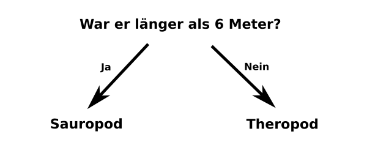

## Kategorisiere die Dinosaurier

<html>
  

    <iframe style="position: absolute; top: 0; left: 0; right: 0; width: 100%; height: 100%; border: none;" src="https://www.youtube.com/embed/3op4RCy1wRc?rel=0&cc_load_policy=1" allowfullscreen allow="accelerometer; autoplay; clipboard-write; encrypted-media; gyroscope; picture-in-picture; web-share"></iframe>
  

</html>

**Ziel des Projekts:** Jeder Dinosaurier ist in einer **Kategorie**. Eine Kategorie beschreibt eine Gruppe von Dinosauriern mit ähnlichen Merkmalen. Bestimme die Kategorien der Dinosaurier anhand der vorliegenden Informationen.

Hier sind einige Fakten für zwei verschiedenen Dinosaurier:

(mya: vor Millionen Jahren)

| Name         | Länge (m) | Ernährung       | Kontinent   | Lebenszeit (mya) | Kategorie |
| ------------ | ---------------------------- | --------------- | ----------- | ----------------------------------- | --------- |
| Konkavenator | 6                            | Fleischfresser  | Europa      | 130                                 | Theropode |
| Diplodocus   | 26                           | Pflanzenfresser | Nordamerika | 152                                 | Sauropod  |

Du kannst diese Daten in zwei **Kategorien** der Dinosaurier aufteilen, indem du diese Frage stellst:

Wenn die Antwort **Ja** lautet, muss der Dinosaurier ein Sauropod sein, und wenn sie **Nein** lautet, muss es ein Theropode sein.

\--- task ---

Überlege dir eine andere Frage, die du stellen könntest, um diese beiden Dinosaurierkategorien voneinander zu unterscheiden.

## --- collapse ---

## Titel: Zeig mir die Antwort

- Lebte er in Nordamerika?
- War er ein Fleischfresser?
- Beginnt sein Name mit „C“?
- Lebte er vor mehr als 130 Millionen Jahren?

\--- /collapse ---

\--- /task ---
