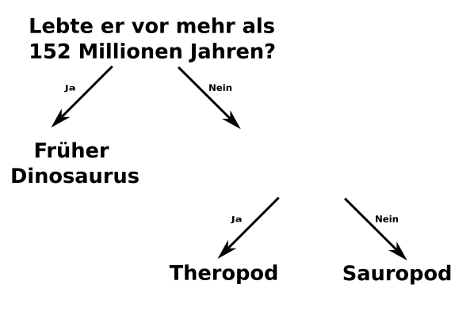

## Mehre Fragen

<html>
  

    <iframe style="position: absolute; top: 0; left: 0; right: 0; width: 100%; height: 100%; border: none;" src="https://www.youtube.com/embed/1YGBq7GWiZU?rel=0&cc_load_policy=1" allowfullscreen allow="accelerometer; autoplay; clipboard-write; encrypted-media; gyroscope; picture-in-picture; web-share"></iframe>
  

</html>

Lass uns einen weiteren Dinosaurier hinzufügen

| Name          | Länge (m) | Ernährung       | Kontinent   | Lebenszeit (mya) | Kategorie          |
| ------------- | ---------------------------- | --------------- | ----------- | ----------------------------------- | ------------------ |
| Allosaurus    | 12                           | Fleischfresser  | Europa      | 152                                 | Theropode          |
| Konkavenator  | 6                            | Fleischfresser  | Europa      | 130                                 | Theropode          |
| Diplodocus    | 26                           | Pflanzenfresser | Nordamerika | 152                                 | Sauropod           |
| Herrerasaurus | 3                            | Fleischfresser  | Südamerika  | 228                                 | Früher Dinosaurier |

\--- task ---

Ist es  möglich, die Dinosaurier mithilfe der Frage **"Hat er vor mehr als 130 Millionen Jahren gelebt?"** in Kategorien einzuteilen?

## --- collapse ---

## title: Zeige mir die Antwort

Nein, denn es gibt mittlerweile drei Dinosaurier, die vor mehr als 130 Millionen Jahren lebten, aber sie fallen in unterschiedliche Kategorien.

Selbst wenn du die Kriterien auf **vor mehr als 152 Millionen Jahren** ändern würdest, könntest du sie immer noch nicht in drei Kategorien unterteilen.

\--- /collapse ---

\--- /task ---

Um Dinosaurier in drei Kategorien einzuteilen, musst du eine weitere Frage hinzufügen.

\--- task ---

Wähle einen **anderen** Datentyp aus der Tabelle aus, beispielsweise Länge oder Ernährung.

Welche Frage könntest du anhand dieser Daten in die leere Stelle schreiben, um die verbleibenden Dinosaurier richtig zu kategorisieren?

## --- collapse ---

## title: Zeige mir die Antwort

Jede der folgenden Fragen würde für jeden Dinosaurier die richtige Kategorie ergeben:

- War er kürzer als 26 Meter?
- War er ein Fleischfresser?
- Lebte er in Europa?

\--- /collapse ---

\--- /task ---
