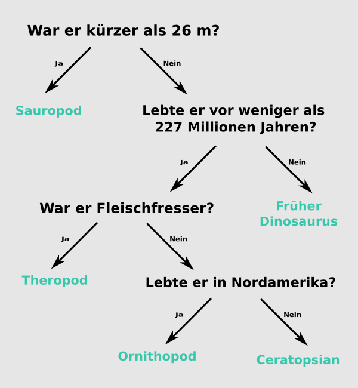

## Entscheidungsbaum

--- challenge ---

<html>
  

    <iframe style="position: absolute; top: 0; left: 0; right: 0; width: 100%; height: 100%; border: none;" src="https://www.youtube.com/embed/mYkxL-efCIs?rel=0&cc_load_policy=1" allowfullscreen allow="accelerometer; autoplay; clipboard-write; encrypted-media; gyroscope; picture-in-picture; web-share"></iframe>
  

</html>

Ein Künstliches Intelligenz-Modell, das einen Entscheidungsbaum verwendet, muss seine Kriterien wiederholt verfeinern. Je mehr Daten eingegeben werden, desto genauer wird es – das nennt man **Training**. Du hast bisher nur wenige Kriterien verwendet, aber ein Künstliches Intelligenz-Modelle kann viele **Tausende** Werte verwenden.

Hier ist ein größerer Datensatz über Dinosaurier:

(mya: vor Millionen Jahren)

| Name            | Länge (m) | Ernährung       | Kontinent   | Lebenszeit (mya) | Kategorie          |
| --------------- | ---------------------------- | --------------- | ----------- | ----------------------------------- | ------------------ |
| Allosaurus      | 12                           | Fleischfresser  | Europa      | 152                                 | Theropode          |
| Archaeoceratops | 1,3                          | Pflanzenfresser | Asien       | 121                                 | Ceratopsier        |
| Bambiraptor     | 1                            | Fleischfresser  | Nordamerika | 84                                  | Theropode          |
| Brachiosaurus   | 30                           | Pflanzenfresser | Nordamerika | 155                                 | Sauropod           |
| Chindesaurus    | 4                            | Fleischfresser  | Nordamerika | 227                                 | Früher Dinosaurier |
| Konkavenator    | 6                            | Fleischfresser  | Europa      | 130                                 | Theropode          |
| Diplodocus      | 26                           | Pflanzenfresser | Nordamerika | 152                                 | Sauropod           |
| Herrerasaurus   | 3                            | Fleischfressend | Südamerika  | 228                                 | Früher Dinosaurier |
| Maiasaura       | 9                            | Pflanzenfresser | Nordamerika | 80                                  | Ornithopod         |
| Parksosaurus    | 3                            | Pflanzenfresser | Nordamerika | 76                                  | Ornithopod         |
| Zephyrosaurus   | 1.8          | Pflanzenfresser | Nordamerika | 120                                 | Ornithopod         |

Lade diese [Dinosaurierkarten](resources/dinosaur_cards.pdf){:target="_blank"} herunter, drucke sie aus und verwende sie zum Zeichnen des Entscheidungsbaums.

--- task ---

Zeichne einen Entscheidungsbaum, der es dir ermöglicht, jede **Kategorie** von Dinosauriern richtig zu identifizieren.

**Tipp:** Jede Frage sollte die Daten so aufteilen, dass eine Dinosaurierkategorie vollständig identifiziert wird.

--- /task ---

--- task ---

[Wählen einen anderen Dinosaurier](https://www.nhm.ac.uk/discover/dino-directory.html){:target="_blank"} und verwenden deinen Entscheidungsbaum, um zu ermitteln, in welche Kategorie er fällt. War dein Entscheidungsbaum richtig?

--- /task ---

--- collapse ---
---
title: Zeige mir die Antwort
---

Hier ist eine mögliche Lösung, aber es gibt viele gültige Bäume, die du zeichnen kannst:

--- /collapse ---

--- /challenge ---
