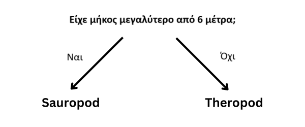

## Κατηγοριοποίησε τους δεινόσαυρους

<html>
  

    <iframe style="position: absolute; top: 0; left: 0; right: 0; width: 100%; height: 100%; border: none;" src="https://www.youtube.com/embed/3op4RCy1wRc?rel=0&cc_load_policy=1" allowfullscreen allow="accelerometer; autoplay; clipboard-write; encrypted-media; gyroscope; picture-in-picture; web-share"></iframe>
  

</html>

**Στόχος του έργου:** Κάθε δεινόσαυρος να ανήκει σε μια **κατηγορία**. Μια κατηγορία περιγράφει μια ομάδα δεινοσαύρων με παρόμοια χαρακτηριστικά. Πρέπει να προσδιορίσεις σε ποια κατηγορία ανήκει ένας δεινόσαυρος, χρησιμοποιώντας τα στοιχεία που έχεις για τον δεινόσαυρο.

Ακολουθούν μερικά στοιχεία για δύο διαφορετικούς δεινόσαυρους:

(mya = million years ago)

| Name         | Length (m) | Diet        | Continent     | Lived (mya) | Category |
| ------------ | ----------------------------- | ----------- | ------------- | ------------------------------ | -------- |
| Concavenator | 6                             | Carnivorous | Europe        | 130                            | Theropod |
| Diplodocus   | 26                            | Herbivorous | North America | 152                            | Sauropod |

Θα μπορούσες να διαχωρίσεις αυτά τα δεδομένα σε δύο **κατηγορίες** δεινοσαύρων κάνοντας την εξής ερώτηση:

Αν η απάντηση είναι **ναι**, ο δεινόσαυρος πρέπει να είναι Sauropod, και αν είναι **όχι** τότε πρέπει να είναι Theropod.

\--- task ---

Σκέψου μια διαφορετική ερώτηση που θα μπορούσες να κάνεις για να διαχωρίσεις αυτές τις δύο κατηγορίες δεινοσαύρων.

## --- collapse ---

## title: Δείξε μου την απάντηση

- Ζούσε στη Βόρεια Αμερική;
- Ήταν σαρκοφάγος;
- Αρχίζει το όνομά του από «C»;
- Έζησε πριν από περισσότερα από 130 εκατομμύρια χρόνια;

\--- /collapse ---

\--- /task ---
