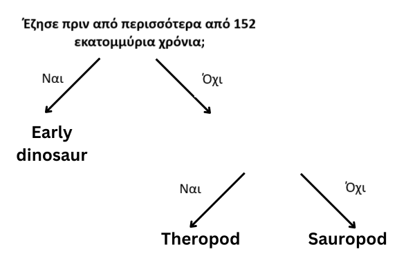

## Περισσότερες από μία ερωτήσεις

<html>
  

    <iframe style="position: absolute; top: 0; left: 0; right: 0; width: 100%; height: 100%; border: none;" src="https://www.youtube.com/embed/1YGBq7GWiZU?rel=0&cc_load_policy=1" allowfullscreen allow="accelerometer; autoplay; clipboard-write; encrypted-media; gyroscope; picture-in-picture; web-share"></iframe>
  

</html>

Ας προσθέσουμε έναν ακόμη δεινόσαυρο:

| Name          | Length (m) | Diet        | Continent     | Lived (mya) | Category       |
| ------------- | ----------------------------- | ----------- | ------------- | ------------------------------ | -------------- |
| Allosaurus    | 12                            | Carnivorous | Europe        | 152                            | Theropod       |
| Concavenator  | 6                             | Carnivorous | Europe        | 130                            | Theropod       |
| Diplodocus    | 26                            | Herbivorous | North America | 152                            | Sauropod       |
| Herrerasaurus | 3                             | Carnivorous | South America | 228                            | Early dinosaur |

\--- task ---

Είναι δυνατόν να χωρίσεις τους δεινόσαυρους σε κατηγορίες χρησιμοποιώντας την ερώτηση **"Έζησε πριν από περισσότερα από 130 εκατομμύρια χρόνια;"**;

## --- collapse ---

## title: Δείξε μου την απάντηση

Όχι, επειδή τώρα υπάρχουν τρεις δεινόσαυροι που έζησαν πριν από περισσότερα από 130 εκατομμύρια χρόνια, αλλά ανήκουν σε διαφορετικές κατηγορίες.

Ακόμα κι αν αλλάξεις τα κριτήρια σε **πριν από περισσότερα από 152 εκατομμύρια χρόνια**, και πάλι δεν μπορείς να τα διαχωρίσεις σε τρεις κατηγορίες.

\--- /collapse ---

\--- /task ---

Για να κατατάξεις τους δεινόσαυρους σε τρεις κατηγορίες, πρέπει να προσθέσεις άλλη μια ερώτηση.

\--- task ---

Επίλεξε ένα **διαφορετικό** στοιχείο δεδομένων από τον πίνακα, για παράδειγμα, μήκος (length) ή διατροφή (diet).

Ποια ερώτηση θα μπορούσες να γράψεις στον κενό χώρο χρησιμοποιώντας αυτά τα δεδομένα για να κατηγοριοποιήσεις σωστά τους υπόλοιπους δεινόσαυρους;

## --- collapse ---

## title: Δείξε μου την απάντηση

Οποιαδήποτε από τις ακόλουθες ερωτήσεις θα έδινε τη σωστή κατηγορία για κάθε δεινόσαυρο:

- Είχε μήκος μικρότερο από 26 μέτρα;
- Ήταν σαρκοφάγος (carnivore);
- Έζησε στην Ευρώπη;

\--- /collapse ---

\--- /task ---
