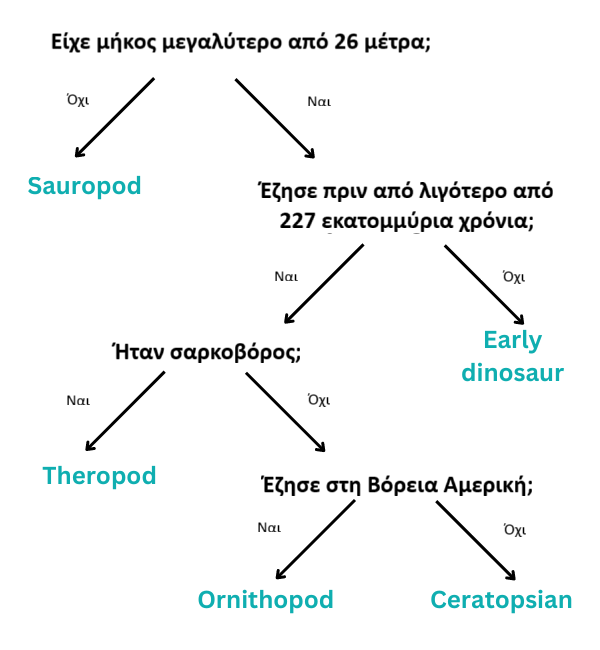

## Δέντρο αποφάσεων

--- challenge ---

<html>
  

    <iframe style="position: absolute; top: 0; left: 0; right: 0; width: 100%; height: 100%; border: none;" src="https://www.youtube.com/embed/mYkxL-efCIs?rel=0&cc_load_policy=1" allowfullscreen allow="accelerometer; autoplay; clipboard-write; encrypted-media; gyroscope; picture-in-picture; web-share"></iframe>
  

</html>

Ένα μοντέλο μηχανικής μάθησης που χρησιμοποιεί ένα δέντρο αποφάσεων πρέπει να βελτιώνει επανειλημμένα τα κριτήριά του. Όσο περισσότερα δεδομένα εισάγονται, τόσο πιο ακριβές γίνεται το μοντέλο— αυτό ονομάζεται **εκπαίδευση**. Χρησιμοποίησες μόνο μερικά κριτήρια, αλλά ένα μοντέλο μηχανικής μάθησης μπορεί να χρησιμοποιεί πολλές **χιλιάδες** τιμές.

Ακολουθεί ένα μεγαλύτερο σύνολο δεδομένων σχετικά με τους δεινόσαυρους:

(mya = million years ago)

| Name            | Length (m) | Diet        | Continent     | Lived (mya) | Category       |
| --------------- | ----------------------------- | ----------- | ------------- | ------------------------------ | -------------- |
| Allosaurus      | 12                            | Carnivorous | Europe        | 152                            | Theropod       |
| Archaeoceratops | 1.3           | Herbivorous | Asia          | 121                            | Ceratopsian    |
| Bambiraptor     | 1                             | Carnivorous | North America | 84                             | Theropod       |
| Brachiosaurus   | 30                            | Herbivorous | North America | 155                            | Sauropod       |
| Chindesaurus    | 4                             | Carnivorous | North America | 227                            | Early dinosaur |
| Concavenator    | 6                             | Carnivorous | Europe        | 130                            | Theropod       |
| Diplodocus      | 26                            | Herbivorous | North America | 152                            | Sauropod       |
| Herrerasaurus   | 3                             | Carnivorous | South America | 228                            | Early dinosaur |
| Maiasaura       | 9                             | Herbivorous | North America | 80                             | Ornithopod     |
| Parksosaurus    | 3                             | Herbivorous | North America | 76                             | Ornithopod     |
| Zephyrosaurus   | 1.8           | Herbivorous | North America | 120                            | Ornithopod     |

Γιατί να μην κατεβάσεις και να εκτυπώσεις αυτές τις [κάρτες δεινοσαύρων](resources/dinosaur_cards.pdf){:target="_blank"} και να τις χρησιμοποιήσεις για να σχεδιάσεις το δέντρο αποφάσεων;

--- task ---

Σχεδίασε ένα δέντρο αποφάσεων που σου επιτρέπει να αναγνωρίσεις σωστά κάθε **κατηγορία** δεινοσαύρου.

**Συμβουλή:** Κάθε ερώτηση θα πρέπει να διαχωρίζει τα δεδομένα έτσι ώστε να προσδιορίζεται απολύτως μία κατηγορία δεινοσαύρου.

--- /task ---

--- task ---

[Επίλεξε έναν άλλο δεινόσαυρο](https://www.nhm.ac.uk/discover/dino-directory.html){:target="_blank"} και χρησιμοποίησε το δέντρο αποφάσεων για να προσδιορίσεις σε ποια κατηγορία ανήκει. Ήταν σωστό το δικό σου δέντρο αποφάσεων;

--- /task ---

--- collapse ---
---
title: Δείξε μου την απάντηση
---

Εδώ είναι μια πιθανή λύση, αλλά υπάρχουν πολλά έγκυρα δέντρα που θα μπορούσες να σχεδιάσεις:

--- /collapse ---

--- /challenge ---
