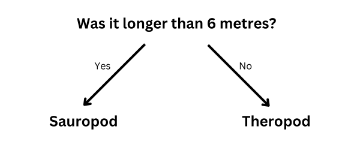

## Classify the dinosaurs

**Aim of the project:** Each dinosaur has a **category**. A category describes a group of dinosaurs with similar characteristics. We want to be able to tell which category a dinosaur is in, using the facts we have about the dinosaur.

Here are some facts about two different dinosaurs:

(mya = million years ago)

| Name         | Length (m)  | Diet        | Continent      | Lived (mya)  | Category  |
|--------------|-------------|-------------|----------------|--------------|-----------|
| Concavenator | 6           | Carnivorous | Europe         | 130          | Theropod  |
| Diplodocus   | 26          | Herbivorous | North America  | 152          | Sauropod  |

You could separate this data into the two **categories** of dinosaur by asking this question:

If the answer is **yes**, the dinosaur must be a Sauropod, and if it is **no** then it must be a Theropod. 

--- task ---
+ Think of a different question you could ask to separate out these two categories of dinosaur.

--- collapse ---
--- 
title: Show me the answer
---

- Did it live in North America?
- Was it carnivorous?
- Does its name begin with 'C'?
- Did it live more than 130 million years ago?

--- /collapse ---

--- /task ---
