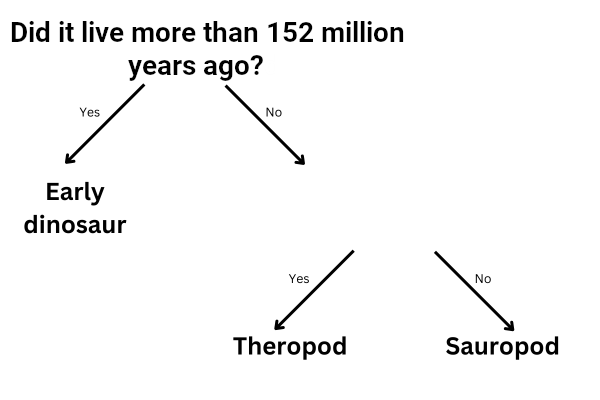

## More than one question

<html>
  

    <iframe style="position: absolute; top: 0; left: 0; right: 0; width: 100%; height: 100%; border: none;" src="https://www.youtube.com/embed/oV5ZEwW6Law?rel=0&cc_load_policy=1" allowfullscreen allow="accelerometer; autoplay; clipboard-write; encrypted-media; gyroscope; picture-in-picture; web-share"></iframe>
  

</html>

Let's add another dinosaur:

| Name         | Length (m)  | Diet        | Continent      | Lived (mya)  | Category  |
|--------------|-------------|-------------|----------------|--------------|-----------|
| Allosaurus   | 12          | Carnivorous | Europe         | 152          | Theropod  |
| Concavenator | 6           | Carnivorous | Europe         | 130          | Theropod  |
| Diplodocus   | 26          | Herbivorous | North America  | 152          | Sauropod  |
| Herrerasaurus| 3           | Carnivorous | South America  | 228          | Early dinosaur |

--- task ---

Is it still possible for you to split the dinosaurs into categories using the question __"Did it live more than 130 million years ago?"__?

--- collapse ---
--- 
title: Show me the answer
---

No, because there are now three dinosaurs that lived more than 130 million years ago, but they are in different categories. 

Even if you changed the criteria to **more than 152 million years ago**, you still can't separate them into three categories. 

--- /collapse ---

--- /task ---

To put dinosaurs in three categories, you need to add another question. 

--- task ---

Choose a **different** piece of data from the table; for example, length or diet.

What question could you write using this data in the blank space to correctly categorise the remaining dinosaurs?

--- collapse ---
--- 
title: Show me the answer
---
Any of the following questions would give the correct category for every dinosaur:

- Was it shorter than 26 metres?
- Was it a carnivore?
- Did it live in Europe?

--- /collapse ---

--- /task ---
