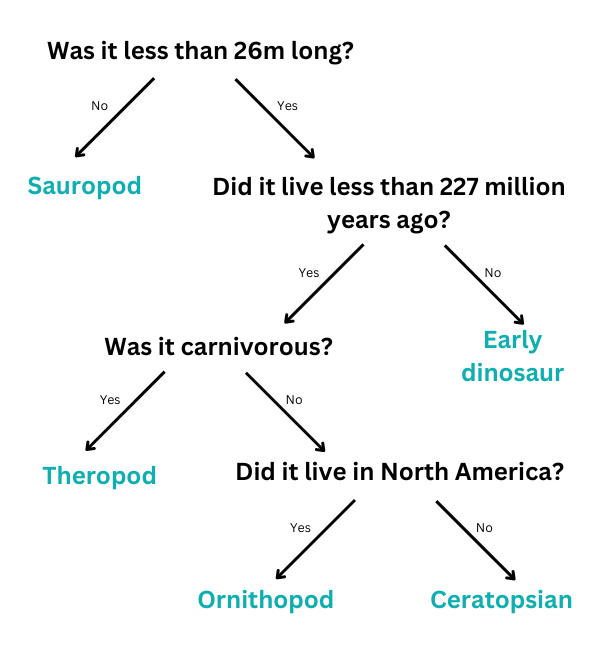

## Decision tree

--- challenge ---

<html>
  

    <iframe style="position: absolute; top: 0; left: 0; right: 0; width: 100%; height: 100%; border: none;" src="https://www.youtube.com/embed/HgiUxcWQiLg?rel=0&cc_load_policy=1" allowfullscreen allow="accelerometer; autoplay; clipboard-write; encrypted-media; gyroscope; picture-in-picture; web-share"></iframe>
  

</html>

A machine learning model that uses a decision tree must repeatedly refine its criteria. The more data input, the more accurate it becomes — this is called **training**. You have only used a few criteria, but a machine learning model might use many **thousands** of values. 

Here is a larger set of data about dinosaurs: 

(mya = million years ago)

| Name             | Length (m)  | Diet        | Continent      | Lived (mya)  | Category       |
|------------------|-------------|-------------|----------------|--------------|----------------|
| Allosaurus       | 12          | Carnivorous | Europe         | 152          | Theropod       |
| Archaeoceratops  | 1.3         | Herbivorous | Asia           | 121          | Ceratopsian    |
| Bambiraptor      | 1           | Carnivorous | North America  | 84           | Theropod       |
| Brachiosaurus    | 30          | Herbivorous | North America  | 155          | Sauropod       |
| Chindesaurus     | 4           | Carnivorous | North America  | 227          | Early dinosaur |
| Concavenator     | 6           | Carnivorous | Europe         | 130          | Theropod       |
| Diplodocus       | 26          | Herbivorous | North America  | 152          | Sauropod       |
| Herrerasaurus    | 3           | Carnivorous | South America  | 228          | Early dinosaur |
| Maiasaura        | 9           | Herbivorous | North America  | 80           | Ornithopod     |
| Parksosaurus     | 3           | Herbivorous | North America  | 76           | Ornithopod     |
| Zephyrosaurus    | 1.8         | Herbivorous | North America  | 120          | Ornithopod     |

Why not download and print these [dinosaur cards](resources/dinosaur_cards.pdf){:target="_blank"} and use them to help you draw the decision tree?

--- task ---

Draw a decision tree that allows you to correctly identify each **category** of dinosaur. 

**Tip:** Each question should split the data so that one category of dinosaur is fully identified.

--- /task ---

--- task ---

[Choose another dinosaur](https://www.nhm.ac.uk/discover/dino-directory.html){:target="_blank"} and use your decision tree to identify which category it is in. Was your decision tree correct?

--- /task ---

--- collapse ---
--- 
title: Show me the answer
---
Here is one possible solution, but there are many valid trees you could draw:

--- /collapse ---

--- /challenge ---
