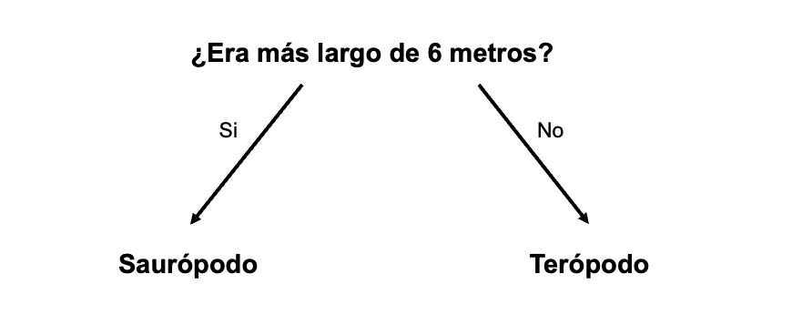

## Clasifica los dinosaurios

<html>
  

    <iframe style="position: absolute; top: 0; left: 0; right: 0; width: 100%; height: 100%; border: none;" src="https://www.youtube.com/embed/3op4RCy1wRc?rel=0&cc_load_policy=1" allowfullscreen allow="accelerometer; autoplay; clipboard-write; encrypted-media; gyroscope; picture-in-picture; web-share"></iframe>
  

</html>

**Objetivo del proyecto:** Cada dinosaurio tiene una <0>**categoría**</0>. Una categoría describe un grupo de dinosaurios con características similares. Tienes que indicar en qué categoría está el dinosaurio, utilizando los datos que tienes.

Aquí hay algunos datos sobre dos dinosaurios diferentes:

(mya = hace millones de años)

| Nombre       | Longitud (m) | Dieta     | Continente        | Vivió (mya) | Categoría |
| ------------ | ------------------------------- | --------- | ----------------- | ------------------------------ | --------- |
| Concavenador | 6                               | Carnívoro | Europa            | 130                            | Terópodo  |
| Diplodocus   | 26                              | Herbívoro | América del norte | 152                            | Saurópodo |

Podrías separar estos datos en las dos <0>**categorías**</0> de dinosaurios haciendo esta pregunta:

Si la respuesta es **sí**, el dinosaurio debe ser un saurópodo, y si es **no**, entonces debe ser un terópodo.

\--- task ---

Piensa en una pregunta diferente que podrías hacer para separar estas dos categorías de dinosaurios.

## --- collapse ---

## Título: Muéstrame la respuesta

- ¿Vivió en América del Norte?
- ¿Era carnívoro?
- ¿Su nombre empieza con C?
- ¿Vivió hace más de 130 millones de años?

\--- /collapse ---

\--- /task ---
