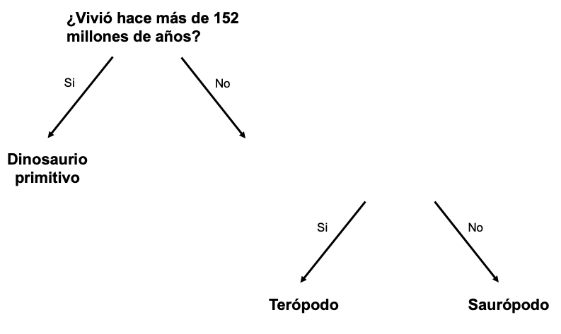

## Más de una pregunta

<html>
  

    <iframe style="position: absolute; top: 0; left: 0; right: 0; width: 100%; height: 100%; border: none;" src="https://www.youtube.com/embed/1YGBq7GWiZU?rel=0&cc_load_policy=1" allowfullscreen allow="accelerometer; autoplay; clipboard-write; encrypted-media; gyroscope; picture-in-picture; web-share"></iframe>
  

</html>

Agreguemos otro dinosaurio:

| Nombre        | Longitud (m) | Dieta     | Continente        | Vivió (mya) | Categoría            |
| ------------- | ------------------------------- | --------- | ----------------- | ------------------------------ | -------------------- |
| Allosaurio    | 12                              | Carnívoro | Europa            | 152                            | Terópodo             |
| Concavenador  | 6                               | Carnívoro | Europa            | 130                            | Terópodo             |
| Diplodocus    | 26                              | Herbívoro | América del norte | 152                            | Saurópodo            |
| Herrerasaurus | 3                               | Carnívoro | América del sur   | 228                            | Dinosaurio primitivo |

\--- task ---

¿Es posible dividir a los dinosaurios en categorías utilizando la pregunta **"¿Vivió hace más de 130 millones de años?"**?

## --- collapse ---

## Título: Muéstrame la respuesta

No, porque ahora hay tres dinosaurios que vivieron hace más de 130 millones de años, pero están en categorías diferentes.

Incluso si cambiaras el criterio a **hace más de 152 millones de años**, aún no podrías separarlos en tres categorías.

\--- /collapse ---

\--- /task ---

Para poner a los dinosaurios en tres categorías, necesitas agregar otra pregunta.

\--- task ---

Elije un dato **diferente** de la tabla; por ejemplo, longitud o dieta.

¿Qué pregunta podrías escribir usando estos datos en el espacio en blanco para categorizar correctamente a los dinosaurios restantes?

## --- collapse ---

## Título: Muéstrame la respuesta

Cualquiera de las siguientes preguntas daría la categoría correcta para cada dinosaurio:

- ¿Era más corto que 26 metros?
- ¿Era un carnívoro?
- ¿Vivió en Europa?

\--- /collapse ---

\--- /task ---
