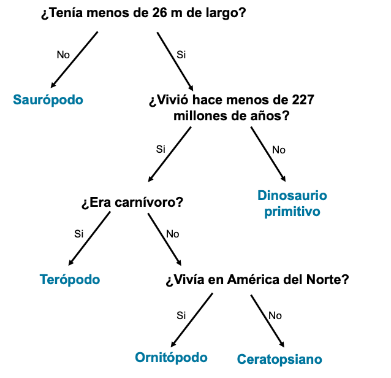

## Árbol de decisiones

\--- challenge ---

<html>
  

    <iframe style="position: absolute; top: 0; left: 0; right: 0; width: 100%; height: 100%; border: none;" src="https://www.youtube.com/embed/mYkxL-efCIs?rel=0&cc_load_policy=1" allowfullscreen allow="accelerometer; autoplay; clipboard-write; encrypted-media; gyroscope; picture-in-picture; web-share"></iframe>
  

</html>

Un modelo de aprendizaje automático que utiliza un árbol de decisiones debe refinar repetidamente sus criterios. Cuantos más datos se introduzcan, más precisos serán: esto se llama **entrenamiento**. Solo has utilizado unos pocos criterios, pero un modelo de aprendizaje automático podría utilizar muchos **miles** de valores.

Aquí hay un conjunto más amplio de datos sobre los dinosaurios:

(mya = hace millones de años)

| Nombre         | Longitud (m) | Dieta     | Continente        | Vivió (mya) | Categoría            |
| -------------- | ------------------------------- | --------- | ----------------- | ------------------------------ | -------------------- |
| Allosaurio     | 12                              | Carnívoro | Europa            | 152                            | Terópodo             |
| Arqueoceratops | 1.3             | Herbívoro | Asia              | 121                            | Ceratopsiano         |
| Bambiraptor    | 1                               | Carnívoro | América del norte | 84                             | Terópodo             |
| Braquiosaurio  | 30                              | Herbívoro | América del norte | 155                            | Saurópodo            |
| Chindesauro    | 4                               | Carnívoro | América del norte | 227                            | Dinosaurio primitivo |
| Concavenador   | 6                               | Carnívoro | Europa            | 130                            | Terópodo             |
| Diplodocus     | 26                              | Herbívoro | América del norte | 152                            | Saurópodo            |
| Herrerasaurus  | 3                               | Carnívoro | América del sur   | 228                            | Dinosaurio primitivo |
| Maiasaura      | 9                               | Herbívoro | América del norte | 80                             | Ornitópodo           |
| Parksosaurus   | 3                               | Herbívoro | América del norte | 76                             | Ornitópodo           |
| Zephyrosaurus  | 1.8             | Herbívoro | América del norte | 120                            | Ornitópodo           |

¿Por qué no descargas e imprimes estas [tarjetas de dinosaurio](resources/dinosaur_cards.pdf){:target="_blank"} y las usas para dibujar el árbol de decisiones?

\--- task ---

Dibuja un árbol de decisiones que te permita identificar correctamente cada <0>**categoría**</0> de dinosaurio.

**Consejo:** Cada pregunta debe dividir los datos para que se identifique completamente una categoría de dinosaurio.

\--- /task ---

\--- task ---

[Elige otro dinosaurio](https://www.nhm.ac.uk/discover/dino-directory.html){:target="_blank"} y usa tu árbol de decisión para identificar en qué categoría se encuentra. ¿Era correcto tu árbol de decisiones?

\--- /task ---

## --- collapse ---

## Título: Muéstrame la respuesta

Aquí hay una posible solución, pero hay muchos árboles válidos que podrías dibujar:

\--- /collapse ---

\--- /challenge ---
