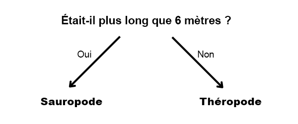

## Classer les dinosaures

<html>
  

    <iframe style="position: absolute; top: 0; left: 0; right: 0; width: 100%; height: 100%; border: none;" src="https://www.youtube.com/embed/3op4RCy1wRc?rel=0&cc_load_policy=1" allowfullscreen allow="accelerometer; autoplay; clipboard-write; encrypted-media; gyroscope; picture-in-picture; web-share"></iframe>
  

</html>

**Objectif du projet :** chaque dinosaure a une **catégorie**. Une catégorie décrit un groupe de dinosaures ayant des caractéristiques similaires. Tu dois déterminer dans quelle catégorie appartient un dinosaure, en utilisant les informations dont tu disposes.

Voici quelques faits sur deux dinosaures différents :

(mda = millions d'années)

| Nom        | Longueur (m) | Alimentation | Continent      | A vécu (mda) | Catégorie  |
|------------|--------------|--------------|----------------|--------------|------------|
| Concavenator | 6           | Carnivore    | Europe         | 130          | Théropode |
| Diplodocus   | 26          | Herbivore    | Amérique du Nord | 152          | Sauropode |

Tu peux séparer ces données en deux **catégories** de dinosaures en posant cette question :

Si la réponse est **oui**, le dinosaure doit être un sauropode, et si c'est **non**, alors il doit être un théropode.

--- task ---

Réfléchis à une question différente que tu pourrais poser pour distinguer ces deux catégories de dinosaures.

--- collapse ---
---
title: Montrer la réponse
---

- A-t-il vécu en Amérique du Nord ?
- Était-il carnivore ?
- Son nom commence-t-il par « C » ?
- A-t-il vécu il y a plus de 130 millions d’années ?

--- /collapse ---

--- /task ---
