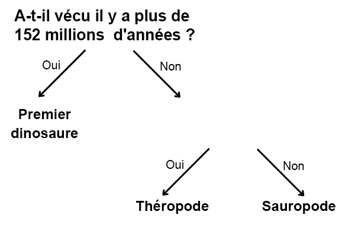

## Plus d'une question

<html>
  

    <iframe style="position: absolute; top: 0; left: 0; right: 0; width: 100%; height: 100%; border: none;" src="https://www.youtube.com/embed/1YGBq7GWiZU?rel=0&cc_load_policy=1" allowfullscreen allow="accelerometer; autoplay; clipboard-write; encrypted-media; gyroscope; picture-in-picture; web-share"></iframe>
  

</html>

Ajoutons un autre dinosaure :

| Nom           | Longueur (m) | Alimentation | Continent        | A vécu (mda) | Catégorie         |
| ------------- | ------------------------------- | ------------ | ---------------- | ------------------------------- | ----------------- |
| Allosaure     | 12                              | Carnivore    | Europe           | 152                             | Théropode         |
| Concavenator  | 6                               | Carnivore    | Europe           | 130                             | Théropode         |
| Diplodocus    | 26                              | Herbivore    | Amérique du Nord | 152                             | Sauropode         |
| Herrerasaurus | 3                               | Carnivore    | Amérique du Sud  | 228                             | Premier dinosaure |

\--- task ---

Est-il possible de diviser les dinosaures en catégories en utilisant la question **« A-t-il vécu il y a plus de 130 millions d'années ? »** ?

## --- collapse ---

## title: Montrer la réponse

Non, car il existe maintenant trois dinosaures qui ont vécu il y a plus de 130 millions d’années, mais ils appartiennent à des catégories différentes.

Même si tu changeais les critères à **il y a plus de 152 millions d'années**, tu ne pourrais toujours pas les séparer en trois catégories.

\--- /collapse ---

\--- /task ---

Pour classer les dinosaures en trois catégories, il faut ajouter une autre question.

\--- task ---

Choisis une donnée **différente** dans le tableau ; par exemple, la longueur ou l'alimentation.

Quelle question pourrais-tu écrire en utilisant ces données dans l'espace vide pour classer correctement les dinosaures restants ?

## --- collapse ---

## title: Montrer la réponse

L’une des questions suivantes donnerait la catégorie correcte pour chaque dinosaure :

- Était-il moins long que 26 mètres ?
- Était-il carnivore ?
- A-t-il vécu en Europe ?

\--- /collapse ---

\--- /task ---
