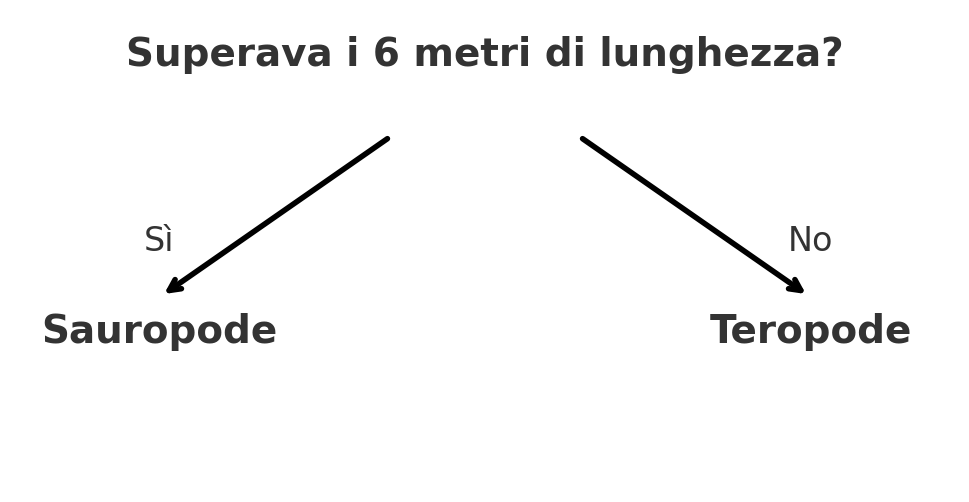

## Classifica i dinosauri

<html>
  

    <iframe style="position: absolute; top: 0; left: 0; right: 0; width: 100%; height: 100%; border: none;" src="https://www.youtube.com/embed/3op4RCy1wRc?rel=0&cc_load_policy=1" allowfullscreen allow="accelerometer; autoplay; clipboard-write; encrypted-media; gyroscope; picture-in-picture; web-share"></iframe>
  

</html>

**Scopo del progetto:** Ogni dinosauro ha una **categoria** . Una categoria descrive un gruppo di dinosauri con caratteristiche simili. Devi determinare a quale categoria appartiene un dinosauro, basandoti sui dati a tua disposizione.

Ecco alcuni fatti su due diversi dinosauri:

(ma = milioni di anni fa)

| Nome         | Lunghezza (m) | Dieta     | Continente       | Vissuto (ma) | Categoria |
| ------------ | -------------------------------- | --------- | ---------------- | ------------------------------- | --------- |
| Concavenator | 6                                | Carnivoro | Europa           | 130                             | Teropode  |
| Diplodoco    | 26                               | Erbivoro  | America del Nord | 152                             | Sauropoda |

Puoi separare questi dati nelle due **categorie** di dinosauri ponendo questa domanda:

Se la risposta è **sì**, il dinosauro deve essere un sauropoda, se invece è **no**, allora deve essere un teropode.

\--- task ---

Pensa a una domanda diversa che potresti porre per distinguere queste due categorie di dinosauri.

## --- collapse ---

## title: Mostrami la risposta

- Viveva in Nord America?
- Era carnivoro?
- Il suo nome inizia con la lettera "C"?
- È vissuto più di 130 milioni di anni fa?

\--- /collapse ---

\--- /task ---
