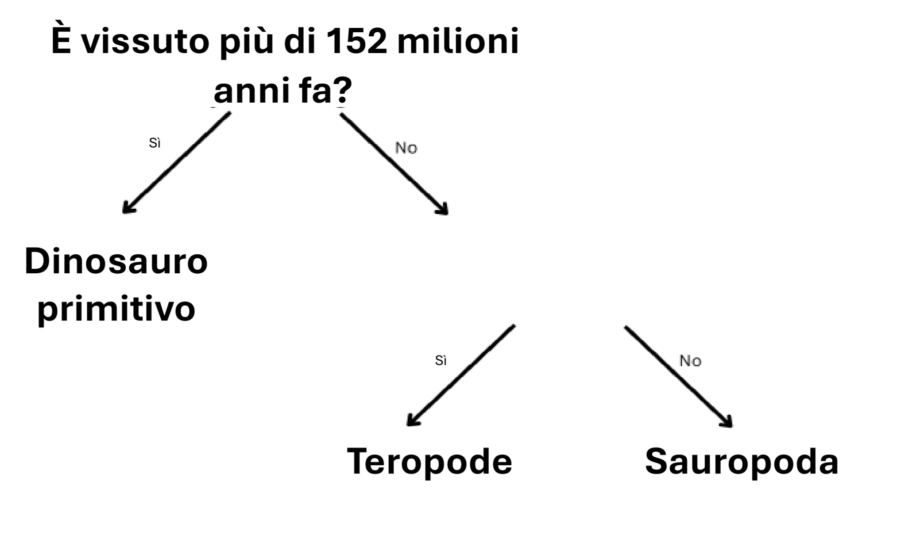

## Più di una domanda

<html>
  

    <iframe style="position: absolute; top: 0; left: 0; right: 0; width: 100%; height: 100%; border: none;" src="https://www.youtube.com/embed/1YGBq7GWiZU?rel=0&cc_load_policy=1" allowfullscreen allow="accelerometer; autoplay; clipboard-write; encrypted-media; gyroscope; picture-in-picture; web-share"></iframe>
  

</html>

Aggiungiamo un altro dinosauro:

| Nome          | Lunghezza (m) | Dieta     | Continente       | Vissuto (ma) | Categoria           |
| ------------- | -------------------------------- | --------- | ---------------- | ------------------------------- | ------------------- |
| Allosauro     | 12                               | Carnivoro | Europa           | 152                             | Teropode            |
| Concavenator  | 6                                | Carnivoro | Europa           | 130                             | Teropode            |
| Diplodoco     | 26                               | Erbivoro  | America del Nord | 152                             | Sauropoda           |
| Herrerasaurus | 3                                | Carnivoro | Sud America      | 228                             | Dinosauro primitivo |

--- task ---

È possibile dividere i dinosauri in categorie utilizzando la domanda **"Erano vissuti più di 130 milioni di anni fa?"**?

--- collapse ---
---
title: Mostrami la risposta
---

No, perché ci sono tre dinosauri vissuti più di 130 milioni di anni fa, ma appartengono a categorie diverse.

Anche se modificassimo il criterio in **più di 152 milioni di anni fa**, non potremmo comunque separarli in tre categorie.

--- /collapse ---

--- /task ---

Per dividere i dinosauri in tre categorie, devi aggiungere un'altra domanda.

--- task ---

Scegli un dato **diverso** dalla tabella, ad esempio lunghezza o dieta.

Quale domanda potresti scrivere utilizzando questi dati nello spazio vuoto per categorizzare correttamente i dinosauri rimanenti?

--- collapse ---
---
title: Mostrami la risposta
---

Ognuna delle seguenti domande fornisce la categoria corretta per ogni dinosauro:

- Aveva una lunghezza inferiore a 26 metri?
- Era carnivoro?
- Viveva in Europa?

--- /collapse ---

--- /task ---
