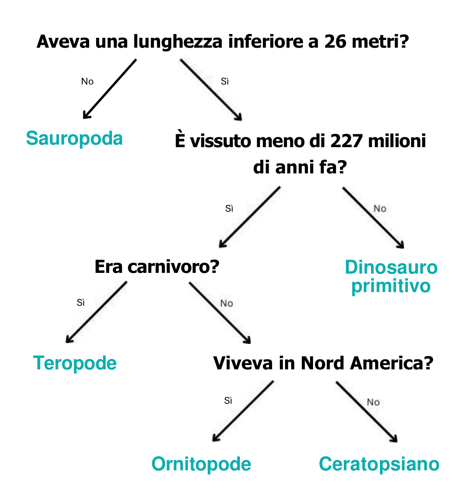

## Albero decisionale

\--- challenge ---

<html>
  

    <iframe style="position: absolute; top: 0; left: 0; right: 0; width: 100%; height: 100%; border: none;" src="https://www.youtube.com/embed/mYkxL-efCIs?rel=0&cc_load_policy=1" allowfullscreen allow="accelerometer; autoplay; clipboard-write; encrypted-media; gyroscope; picture-in-picture; web-share"></iframe>
  

</html>

Un modello di apprendimento automatico che utilizza un albero decisionale deve perfezionare ripetutamente i suoi criteri. Più dati vengono inseriti, più il modello diventa accurato: questo processo è chiamato **addestramento**. Nel tuo caso hai utilizzato solo pochi criteri, ma un modello di apprendimento automatico può basarsi su **migliaia** di valori.

Ecco un set di dati più ampio sui dinosauri:

(ma = milioni di anni fa)

| Nome            | Lunghezza (m) | Dieta     | Continente       | Vissuto (ma) | Categoria           |
| --------------- | -------------------------------- | --------- | ---------------- | ------------------------------- | ------------------- |
| Allosauro       | 12                               | Carnivoro | Europa           | 152                             | Teropode            |
| Archaeoceratops | 1,3                              | Erbivoro  | Asia             | 121                             | Ceratopsiano        |
| Bambiraptor     | 1                                | Carnivoro | America del Nord | 84                              | Teropode            |
| Brachiosauro    | 30                               | Erbivoro  | America del Nord | 155                             | Sauropoda           |
| Chindesauro     | 4                                | Carnivoro | America del Nord | 227                             | Dinosauro primitivo |
| Concavenator    | 6                                | Carnivoro | Europa           | 130                             | Teropode            |
| Diplodoco       | 26                               | Erbivoro  | America del Nord | 152                             | Sauropoda           |
| Herrerasauro    | 3                                | Carnivoro | Sud America      | 228                             | Dinosauro primitivo |
| Maiasaura       | 9                                | Erbivoro  | America del Nord | 80                              | Ornitopode          |
| Parksosauro     | 3                                | Erbivoro  | America del Nord | 76                              | Ornitopode          |
| Zefirosauro     | 1,8                              | Erbivoro  | America del Nord | 120                             | Ornitopode          |

Perché non scarichi e stampi queste [schede dei dinosauri](resources/dinosaur_cards.pdf){:target="_blank"} per usarle come aiuto nel disegnare l'albero decisionale?

\--- task ---

Disegna un albero decisionale per classificare correttamente ogni **categoria** di dinosauro.

**Suggerimento:** ogni domanda dovrebbe suddividere i dati in modo che alla fine ogni categoria sia chiaramente identificata.

\--- /task ---

\--- task ---

[Scegli un altro dinosauro](https://www.nhm.ac.uk/discover/dino-directory.html){:target="_blank"} e usa il tuo albero decisionale per scoprire a quale categoria appartiene. Il tuo albero decisionale era corretto?

\--- /task ---

## --- collapse ---

## title: Mostrami la risposta

Ecco una possibile soluzione, ma ci sono molti altri alberi decisionali validi che potresti creare:

\--- /collapse ---

\--- /challenge ---
