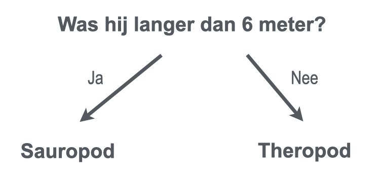

## Dinosaurussen in categorieën onderverdelen

<html>
  

    <iframe style="position: absolute; top: 0; left: 0; right: 0; width: 100%; height: 100%; border: none;" src="https://www.youtube.com/embed/3op4RCy1wRc?rel=0&cc_load_policy=1" allowfullscreen allow="accelerometer; autoplay; clipboard-write; encrypted-media; gyroscope; picture-in-picture; web-share"></iframe>
  

</html>

**Doel van het project:** Elke dinosaurus heeft een **categorie**. Een categorie beschrijft een groep dinosaurussen met vergelijkbare kenmerken. Je moet bepalen in welke categorie een dinosaurus valt, door gebruik te maken van de feiten die je over de dinosaurus hebt.

Hier zijn enkele feiten over twee verschillende dinosaurussen:

(mjg= miljoenen jaren geleden)

| Naam         | Lengte (m) | Voedsel     | Continent     | Tijdperk (mjg) | Categorie |
| ------------ | ----------------------------- | ----------- | ------------- | --------------------------------- | --------- |
| Concavenator | 6                             | Vleeseter   | Europa        | 130                               | Theropod  |
| Diplodocus   | 26                            | Planteneter | Noord-Amerika | 152                               | Sauropod  |

Je kunt deze gegevens opsplitsen in de twee **categorieën** dinosaurussen door deze vraag te stellen:

Als het antwoord **ja** is, dan moet de dinosaurus een Sauropod zijn, als het antwoord **nee** is, dan moet het een Theropod zijn.

\--- task ---

Bedenk een andere vraag die je zou kunnen stellen om deze twee categorieën dinosaurussen te onderscheiden.

## --- collapse ---

## title: Laat me het antwoord zien

- Leefde hij in Noord-Amerika?
- Was het een vleesetend dier?
- Begint de naam met een 'C'?
- Leefde hij meer dan 130 miljoen jaar geleden?

\--- /collapse ---

\--- /task ---
