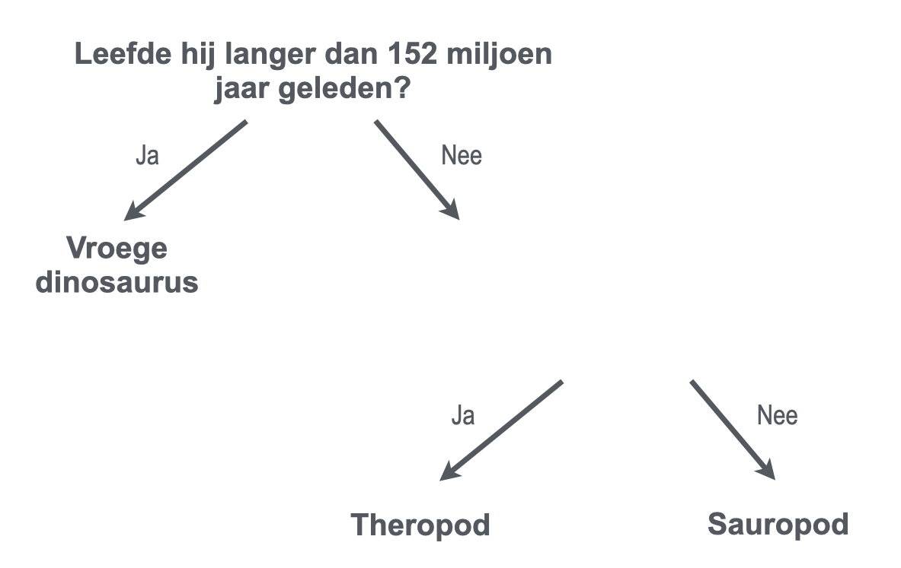

## Meer dan één vraag

<html>
  

    <iframe style="position: absolute; top: 0; left: 0; right: 0; width: 100%; height: 100%; border: none;" src="https://www.youtube.com/embed/1YGBq7GWiZU?rel=0&cc_load_policy=1" allowfullscreen allow="accelerometer; autoplay; clipboard-write; encrypted-media; gyroscope; picture-in-picture; web-share"></iframe>
  

</html>

Laten we nog een dinosaurus toevoegen:

| Naam          | Lengte (m) | Voedsel     | Continent     | Tijdperk (mjg) | Categorie         |
| ------------- | ----------------------------- | ----------- | ------------- | --------------------------------- | ----------------- |
| Allosaurus    | 12                            | Vleeseter   | Europa        | 152                               | Theropod          |
| Concavenator  | 6                             | Vleeseter   | Europa        | 130                               | Theropod          |
| Diplodocus    | 26                            | Planteneter | Noord-Amerika | 152                               | Sauropod          |
| Herrerasaurus | 3                             | Vleeseter   | Zuid-Amerika  | 228                               | Vroege dinosaurus |

\--- task ---

Kun je de dinosaurussen in categorieën verdelen met behulp van de vraag: **"Leefde hij meer dan 130 miljoen jaar geleden?"**?

## --- collapse ---

## title: Laat me het antwoord zien

Nee, want er zijn nu drie dinosaurussen die meer dan 130 miljoen jaar geleden leefden, maar ze vallen in verschillende categorieën.

Zelfs als je de criteria zou veranderen naar **meer dan 152 miljoen jaar geleden**, kun je ze nog steeds niet in drie categorieën verdelen.

\--- /collapse ---

\--- /task ---

Om dinosaurussen in drie categorieën te kunnen indelen, moet je nog een vraag toevoegen.

\--- task ---

Kies een **ander** stukje data uit de tabel, bijvoorbeeld lengte of voedsel.

Welke vraag zou je op basis van deze gegevens in de lege ruimte kunnen formuleren om de overgebleven dinosaurussen correct in te delen?

## --- collapse ---

## title: Laat me het antwoord zien

Elk van de volgende vragen geeft de juiste categorie voor elke dinosaurus:

- Was hij korter dan 26 meter?
- Was het een vleeseter?
- Leefde hij in Europa?

\--- /collapse ---

\--- /task ---
