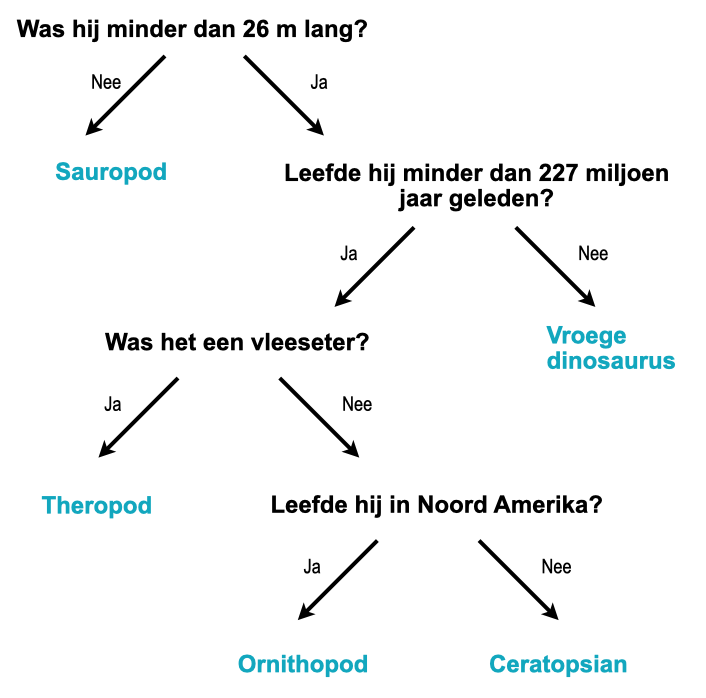

## Beslisboom

\--- challenge ---

<html>
  

    <iframe style="position: absolute; top: 0; left: 0; right: 0; width: 100%; height: 100%; border: none;" src="https://www.youtube.com/embed/mYkxL-efCIs?rel=0&cc_load_policy=1" allowfullscreen allow="accelerometer; autoplay; clipboard-write; encrypted-media; gyroscope; picture-in-picture; web-share"></iframe>
  

</html>

Een machine learning-model dat gebruik maakt van een beslisboom, moet de gebruikte criteria steeds meer verfijnen. Hoe meer gegevens je invoert, hoe nauwkeuriger het model wordt — dit wordt **training** genoemd. Je hebt nog maar een paar criteria gebruikt in je vragen, maar een machine learning model kan enkele **duizenden** waarden gebruiken.

Hier is een grotere set gegevens over dinosaurussen:

(mjg= miljoen jaar geleden)

| Naam           | Lengte (m) | Voedsel     | Continent     | Tijdperk (mjg) | Categorie         |
| -------------- | ----------------------------- | ----------- | ------------- | --------------------------------- | ----------------- |
| Allosaurus     | 12                            | Vleeseter   | Europa        | 152                               | Theropod          |
| Archeoceratops | 1.3           | Planteneter | Azië          | 121                               | Ceratopsian       |
| Bambiraptor    | 1                             | Vleeseter   | Noord-Amerika | 84                                | Theropod          |
| Brachiosaurus  | 30                            | Planteneter | Noord-Amerika | 155                               | Sauropod          |
| Chindesaurus   | 4                             | Vleeseter   | Noord-Amerika | 227                               | Vroege Dinosaurus |
| Concavenator   | 6                             | Vleeseter   | Europa        | 130                               | Theropod          |
| Diplodocus     | 26                            | Planteneter | Noord-Amerika | 152                               | Sauropod          |
| Herrerasaurus  | 3                             | Vleeseter   | Zuid-Amerika  | 228                               | Vroege Dinosaurus |
| Maiasaura      | 9                             | Planteneter | Noord-Amerika | 80                                | Ornithopod        |
| Parksosaurus   | 3                             | Planteneter | Noord-Amerika | 76                                | Ornithopod        |
| Zephyrosaurus  | 1.8           | Planteneter | Noord-Amerika | 120                               | Ornithopod        |

Je zou ook deze [dinosauruskaarten](resources/dinosaur_cards.pdf){:target="_blank"} kunnen downloaden en printen en ze gebruiken om de beslisboom te tekenen.

\--- task ---

Teken een beslisboom waarmee je elke **categorie** dinosaurus correct kunt identificeren.

**Tip:** Splits de gegevens bij elke vraag zo op, zodat één categorie dinosaurussen volledig wordt geïdentificeerd.

\--- /task ---

\--- task ---

[Kies een andere dinosaurus](https://www.nhm.ac.uk/discover/dino-directory.html){:target="_blank"} en gebruik je beslisboom om te bepalen in welke categorie deze valt. Werkte je beslisboom correct?

\--- /task ---

## --- collapse ---

## title: Laat me het antwoord zien

Hier is een mogelijke oplossing, maar er zijn veel andere correcte bomen die je kunt tekenen:

\--- /collapse ---

\--- /challenge ---
