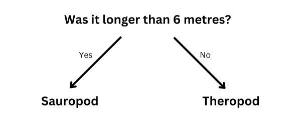

## Sklasyfikuj dinozaury

<html>
  

    <iframe style="position: absolute; top: 0; left: 0; right: 0; width: 100%; height: 100%; border: none;" src="https://www.youtube.com/embed/3op4RCy1wRc?rel=0&cc_load_policy=1" allowfullscreen allow="accelerometer; autoplay; clipboard-write; encrypted-media; gyroscope; picture-in-picture; web-share"></iframe>
  

</html>

**Cel projektu**: Każdy dinozaur ma **kategorię**. Kategoria opisuje grupę dinozaurów o podobnych cechach. Musisz określić, do której kategorii należy dany dinozaur, wykorzystując fakty, jakie o nim posiadasz.

Oto kilka faktów na temat dwóch różnych dinozaurów:

(mlt = milion lat temu)

| Nazwa        | Długość (m) | Dieta        | Kontynent        | Żył (mlt) | Kategoria |
| ------------ | ------------------------------ | ------------ | ---------------- | ---------------------------- | --------- |
| Concavenator | 6                              | Mięsożerny   | Europa           | 130                          | Teropod   |
| Diplodok     | 26                             | Roślinożerny | Ameryka Północna | 152                          | Zauropod  |

Możesz rozdzielić te dane na dwie **kategorie** dinozaurów, zadając następujące pytanie:

Jeśli odpowiedź brzmi **tak**, dinozaur musi być zauropodem, a jeśli **nie**, musi być teropodem.

\--- task ---

Pomyśl jakie inne pytanie mógłbyś zadać, które pozwoliłoby Ci rozróżnić te dwie kategorie dinozaurów.

## --- collapse ---

## title: Pokaż mi odpowiedź

- Czy żył w Ameryce Północnej?
- Czy był mięsożerny?
- Czy jego nazwa zaczyna się na literę "C"?
- Czy żył ponad 130 milionów lat temu?

\--- /collapse ---

\--- /task ---
