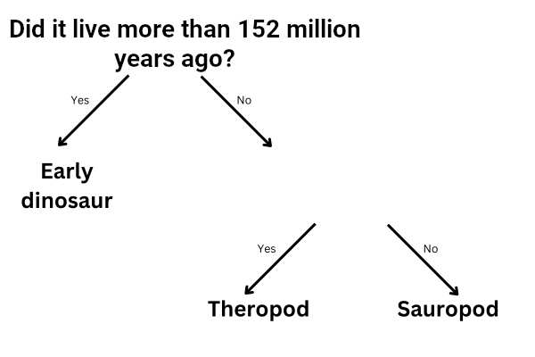

## Więcej niż jedno pytanie

<html>
  

    <iframe style="position: absolute; top: 0; left: 0; right: 0; width: 100%; height: 100%; border: none;" src="https://www.youtube.com/embed/1YGBq7GWiZU?rel=0&cc_load_policy=1" allowfullscreen allow="accelerometer; autoplay; clipboard-write; encrypted-media; gyroscope; picture-in-picture; web-share"></iframe>
  

</html>

Dodajmy jeszcze jednego dinozaura:

| Nazwa        | Długość (m) | Dieta        | Kontynent          | Żył (mlt) | Kategoria        |
| ------------ | ------------------------------ | ------------ | ------------------ | ---------------------------- | ---------------- |
| Allozaur     | 12                             | Mięsożerny   | Europa             | 152                          | Teropod          |
| Concavenator | 6                              | Mięsożerny   | Europa             | 130                          | Teropod          |
| Diplodok     | 26                             | Roślinożerny | Ameryka Północna   | 152                          | Zauropod         |
| Herrerazaur  | 3                              | Mięsożerny   | Ameryka Południowa | 228                          | Dinozaur wczesny |

\--- task ---

Czy możesz podzielić dinozaury na kategorie, odpowiadając na pytanie **"Czy żyły ponad 130 milionów lat temu?"**?

## --- collapse ---

## title: Pokaż mi odpowiedź

Nie, ponieważ obecnie istnieją trzy dinozaury, które żyły ponad 130 milionów lat temu, ale należą one do różnych kategorii.

Nawet jeśli zmienisz kryteria na **ponad 152 miliony lat temu**, nadal nie będziesz mógł podzielić ich na trzy kategorie.

\--- /collapse ---

\--- /task ---

Aby podzielić dinozaury na trzy kategorie, należy dodać kolejne pytanie.

\--- task ---

Wybierz **inny** element danych z tabeli, na przykład długość lub dietę.

Jakie pytanie mógłbyś wpisać w pustej przestrzeni, używając tych danych, aby prawidłowo skategoryzować pozostałe dinozaury?

## --- collapse ---

## title: Pokaż mi odpowiedź

Każde z poniższych pytań pozwoliłoby wskazać poprawną kategorię dla każdego dinozaura:

- Czy miał mniej niż 26 metrów długości?
- Czy był mięsożerny?
- Czy żył w Europie?

\--- /collapse ---

\--- /task ---
