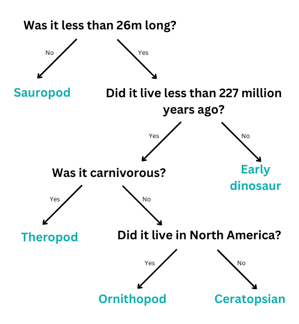

## Drzewo decyzyjne

\--- challenge ---

<html>
  

    <iframe style="position: absolute; top: 0; left: 0; right: 0; width: 100%; height: 100%; border: none;" src="https://www.youtube.com/embed/mYkxL-efCIs?rel=0&cc_load_policy=1" allowfullscreen allow="accelerometer; autoplay; clipboard-write; encrypted-media; gyroscope; picture-in-picture; web-share"></iframe>
  

</html>

Model uczenia maszynowego wykorzystujący drzewo decyzyjne musi wielokrotnie udoskonalać swoje kryteria. Im więcej danych zostanie wprowadzonych, tym bardziej dokładne staną się wyniki — nazywa się to **treningiem**. Użyłeś tylko kilku kryteriów, ale model uczenia maszynowego może wykorzystywać wiele **tysięcy** wartości.

Oto większy zestaw danych o dinozaurach:

(mlt = milion lat temu)

| Nazwa          | Długość (m) | Dieta        | Kontynent          | Żył (mlt) | Kategoria        |
| -------------- | ------------------------------ | ------------ | ------------------ | ---------------------------- | ---------------- |
| Allozaur       | 12                             | Mięsożerny   | Europa             | 152                          | Teropod          |
| Archeoceratops | 1,3                            | Roślinożerny | Azja               | 121                          | Ceratops         |
| Bambiraptor    | 1                              | Mięsożerny   | Ameryka Północna   | 84                           | Teropod          |
| Brachiozaur    | 30                             | Roślinożerny | Ameryka Północna   | 155                          | Zauropod         |
| Czindezaur     | 4                              | Mięsożerny   | Ameryka Północna   | 227                          | Dinozaur wczesny |
| Concavenator   | 6                              | Mięsożerny   | Europa             | 130                          | Teropod          |
| Diplodok       | 26                             | Roślinożerny | Ameryka Północna   | 152                          | Zauropod         |
| Herrerazaur    | 3                              | Mięsożerny   | Ameryka Południowa | 228                          | Dinozaur wczesny |
| Majazaura      | 9                              | Roślinożerny | Ameryka Północna   | 80                           | Ornitopod        |
| Parksozaur     | 3                              | Roślinożerny | Ameryka Północna   | 76                           | Ornitopod        |
| Zefirozaur     | 1.8            | Roślinożerny | Ameryka Północna   | 120                          | Ornitopod        |

Może pobierzesz i wydrukujesz te [karty z dinozaurami](resources/dinosaur_cards.pdf){:target="_blank"} aby pomóc sobie w tworzeniu drzewa decyzyjnego?

\--- task ---

Narysuj drzewo decyzyjne, które pozwoli Ci poprawnie zidentyfikować każdą **kategorię** dinozaura.

**Wskazówka:** Każde pytanie powinno podzielić dane tak, aby w pełni zidentyfikować jedną kategorię dinozaurów.

\--- /task ---

\--- task ---

[Wybierz innego dinozaura](https://www.nhm.ac.uk/discover/dino-directory.html){:target="_blank"} i użyj drzewa decyzyjnego, aby określić, do której kategorii należy. Czy Twoje drzewo decyzyjne było poprawne?

\--- /task ---

## --- collapse ---

## title: Pokaż mi odpowiedź

Oto jedno z możliwych rozwiązań, ale można narysować wiele innych poprawnych drzew:

\--- /collapse ---

\--- /challenge ---
