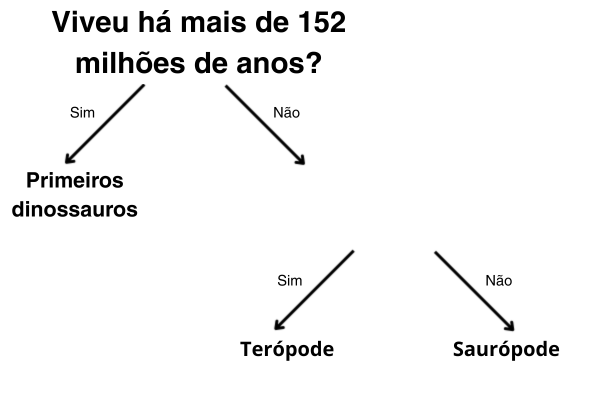

## Mais de uma pergunta

<html>
  

    <iframe style="position: absolute; top: 0; left: 0; right: 0; width: 100%; height: 100%; border: none;" src="https://www.youtube.com/embed/1YGBq7GWiZU?rel=0&cc_load_policy=1" allowfullscreen allow="accelerometer; autoplay; clipboard-write; encrypted-media; gyroscope; picture-in-picture; web-share"></iframe>
  

</html>

Vamos adicionar outro dinossauro:

| Nome          | Comprimento (m) | Dieta     | Continente       | Viveu (Ma) | Categoria             |
| ------------- | ---------------------------------- | --------- | ---------------- | ----------------------------- | --------------------- |
| Alossauro     | 12                                 | Carnívoro | Europa           | 152                           | Terópode              |
| Concavenator  | 6                                  | Carnívoro | Europa           | 130                           | Terópode              |
| Diplodoco     | 26                                 | Herbívoro | América do Norte | 152                           | Saurópode             |
| Herrerassauro | 3                                  | Carnívoro | América do Sul   | 228                           | Primeiros dinossauros |

\--- task ---

É possível dividir os dinossauros em categorias usando a pergunta **"Viveu há mais de 130 milhões de anos?"**?

## --- collapse ---

## título: Mostre-me a resposta

Não, porque agora existem três dinossauros que viveram há mais de 130 milhões de anos, mas eles estão em categorias diferentes.

Mesmo se você alterasse o critério para **mais de 152 milhões de anos atrás**, ainda não seria possível separá-los em três categorias.

\--- /collapse ---

\--- /task ---

Para colocar os dinossauros em três categorias, você precisa adicionar outra pergunta.

\--- task ---

Escolha um dado **diferente** da tabela; por exemplo, comprimento ou dieta.

Que pergunta você poderia escrever usando esses dados no espaço em branco para categorizar corretamente os dinossauros restantes?

## --- collapse ---

## título: Mostre-me a resposta

Qualquer uma das seguintes perguntas forneceria a categoria correta para cada dinossauro:

- Era menor que 26 metros?
- Era carnívoro?
- Viveu na Europa?

\--- /collapse ---

\--- /task ---
