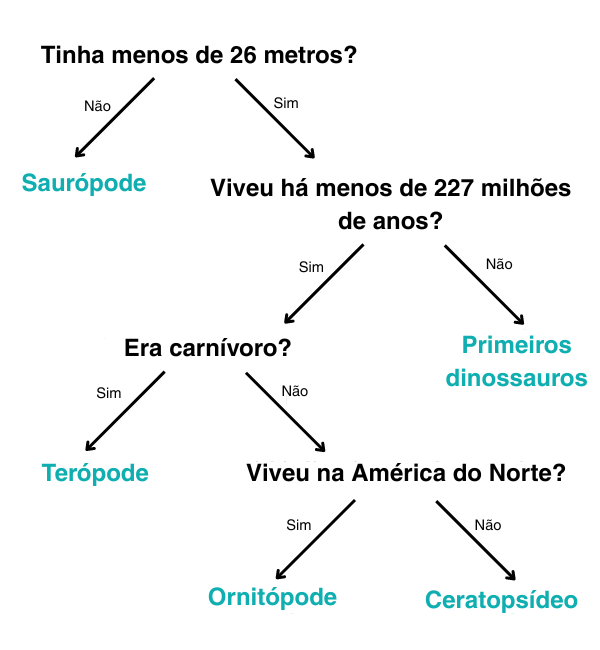

## Árvore de decisão

\--- challenge ---

<html>
  

    <iframe style="position: absolute; top: 0; left: 0; right: 0; width: 100%; height: 100%; border: none;" src="https://www.youtube.com/embed/mYkxL-efCIs?rel=0&cc_load_policy=1" allowfullscreen allow="accelerometer; autoplay; clipboard-write; encrypted-media; gyroscope; picture-in-picture; web-share"></iframe>
  

</html>

Um modelo de aprendizado de máquina que usa uma árvore de decisão deve refinar repetidamente seus critérios. Quanto mais dados são inseridos, mais preciso eles se tornam — isso é chamado de **treinamento**. Você usou apenas alguns critérios, mas um modelo de aprendizado de máquina pode usar **milhares** de valores.

Aqui está um conjunto maior de dados sobre dinossauros:

(Ma = milhões de anos atrás)

| Nome            | Comprimento (m) | Dieta     | Continente       | Viveu (Ma) | Categoria             |
| --------------- | ---------------------------------- | --------- | ---------------- | ----------------------------- | --------------------- |
| Alossauro       | 12                                 | Carnívoro | Europa           | 152                           | Terópode              |
| Archaeoceratops | 1.3                | Herbívoro | Ásia             | 121                           | Ceratopsídeo          |
| Bambiraptor     | 1                                  | Carnívoro | América do Norte | 84                            | Terópode              |
| Braquiossauro   | 30                                 | Herbívoro | América do Norte | 155                           | Saurópode             |
| Chindesaurus    | 4                                  | Carnívoro | América do Norte | 227                           | Primeiros dinossauros |
| Concavenator    | 6                                  | Carnívoro | Europa           | 130                           | Terópode              |
| Diplodoco       | 26                                 | Herbívoro | América do Norte | 152                           | Saurópode             |
| Herrerassauro   | 3                                  | Carnívoro | América do Sul   | 228                           | Primeiros dinossauros |
| Maiasaura       | 9                                  | Herbívoro | América do Norte | 80                            | Ornitópode            |
| Parksosaurus    | 3                                  | Herbívoro | América do Norte | 76                            | Ornitópode            |
| Zephyrosaurus   | 1.8                | Herbívoro | América do Norte | 120                           | Ornitópode            |

Por que não baixar e imprimir esses [cartões de dinossauro](resources/dinosaur_cards.pdf){:target="_blank"} e usá-los para ajudar você a desenhar a árvore de decisão?

\--- task ---

Desenhe uma árvore de decisão que permita identificar corretamente cada **categoria** de dinossauro.

**Dica:** Cada pergunta deve dividir os dados para que uma categoria de dinossauro seja totalmente identificada.

\--- /task ---

\--- task ---

[Escolha outro dinossauro](https://www.nhm.ac.uk/discover/dino-directory.html){:target="_blank"} e use sua árvore de decisão para identificar em qual categoria ele está. Sua árvore de decisão estava correta?

\--- /task ---

## --- collapse ---

## título: Mostre-me a resposta

Aqui está uma solução possível, mas há muitas árvores válidas que você pode desenhar:

\--- /collapse ---

\--- /challenge ---
