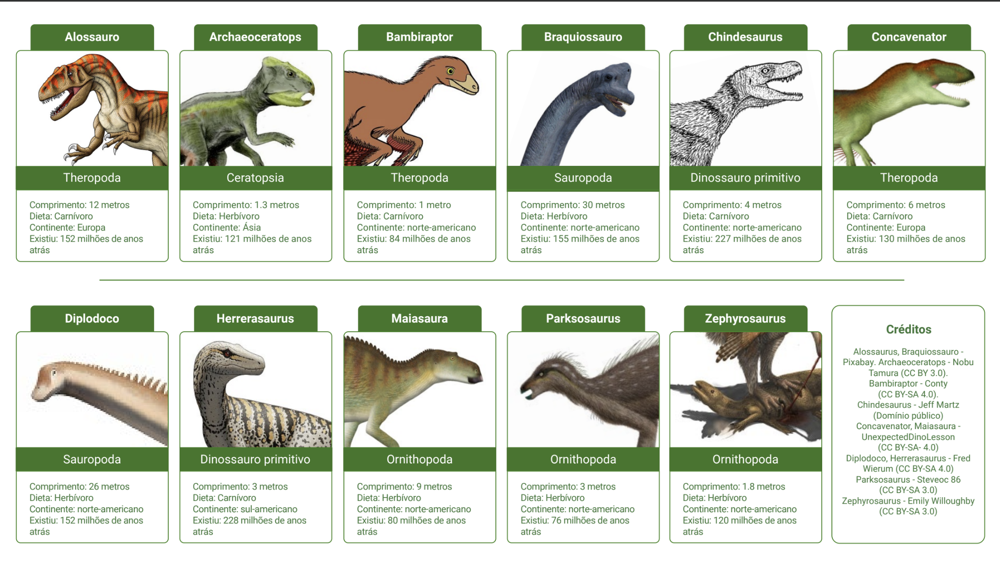

## O que vais fazer

Alguns modelos de machine learning usam **árvores de decisão** para classificar dados.

Cria a tua própria árvore de decisão em papel para classificar os dinossauros e aprende como um modelo é treinado.

--- collapse ---
---
title: Não tens Youtube? Descarrega o vídeo!
---

Podes descarregar todos os vídeos deste projeto, incluindo o vídeo acima [ao clicar aqui](https://rpf.io/p/pt-PT/decision-tree-go){:target="_blank"}.

--- /collapse ---

### Dados

Os dados deste projeto são do [Dino Directory](https://www.nhm.ac.uk/discover/dino-directory.html){:target="_blank"} do Museu de História Nacional.

Ilustrações de dinossauros:
Alossauro, Braquiossauro - Pixabay. Archaeoceratops - Nobu Tamura (CC BY 3.0). Bambiraptor - Conty (CC BY-SA 4.0). Chindesaurus - Jeff Martz (Domínio Público). Concavenator, Maiasaura - UnexpectedDinoLesson (CC BY-SA 4.0). Diplodoco, Herrerasaurus - Fred Wierum (CC BY-SA 4.0). Parksosaurus - Steveoc 86 (CC BY-SA 3.0). Zephyrosaurus - Emily Willoughby (CC BY-SA 3.0).