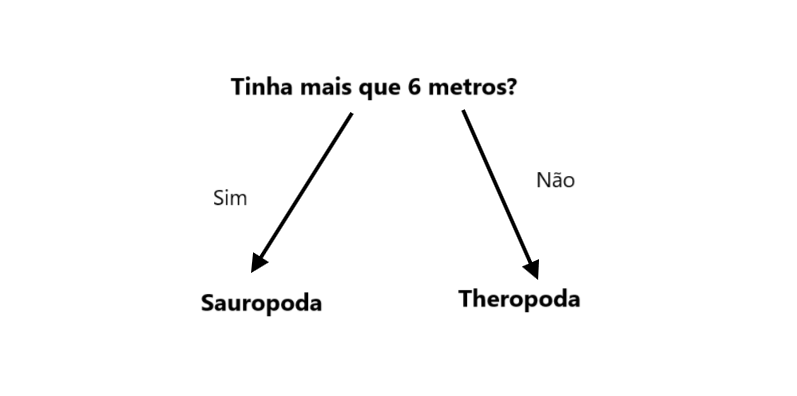

## Classifica os dinossauros

<html>
  

    <iframe style="position: absolute; top: 0; left: 0; right: 0; width: 100%; height: 100%; border: none;" src="https://www.youtube.com/embed/3op4RCy1wRc?rel=0&cc_load_policy=1" allowfullscreen allow="accelerometer; autoplay; clipboard-write; encrypted-media; gyroscope; picture-in-picture; web-share"></iframe>
  

</html>

**Objetivo do projeto.** Cada dinossauro tem uma **categoria**. Uma categoria descreve um grupo de dinossauros com características semelhantes. Precisas de dizer em qual categoria um dinossauro está, usando os factos que tens sobre ele.

Aqui estão alguns factos sobre dois dinossauros diferentes:

(Ma = milhões de anos atrás)

| Nome         | Comprimento (m) | Dieta     | Continente       | Existência (Ma) | Categoria |
| ------------ | ---------------------------------- | --------- | ---------------- | ---------------------------------- | --------- |
| Concavenator | 6                                  | Carnívoro | Europa           | 130                                | Theropoda |
| Diplodoco    | 26                                 | Herbívoro | América do Norte | 152                                | Sauropoda |

Podes separar estes dados em duas **categorias** de dinossauros ao fazer esta pergunta:

Se a resposta for **sim**, o dinossauro deve ser um Sauropoda, e se for **não** deve ser um Theropoda.

\--- task ---

Pensa numa pergunta diferente que possas fazer para separar estas duas categorias de dinossauros.

## --- collapse ---

## title: Mostra-me a resposta

- Viveu na América do Norte?
- Era carnívoro?
- O nome começa com 'C'?
- Viveu há mais de 130 milhões de anos?

\--- /collapse ---

\--- /task ---
