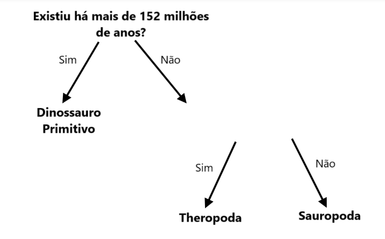

## Mais do que uma pergunta

<html>
  

    <iframe style="position: absolute; top: 0; left: 0; right: 0; width: 100%; height: 100%; border: none;" src="https://www.youtube.com/embed/1YGBq7GWiZU?rel=0&cc_load_policy=1" allowfullscreen allow="accelerometer; autoplay; clipboard-write; encrypted-media; gyroscope; picture-in-picture; web-share"></iframe>
  

</html>

Vamos adicionar outro dinossauro:

| Nome          | Comprimento (m) | Dieta     | Continente       | Existência (Ma) | Categoria            |
| ------------- | ---------------------------------- | --------- | ---------------- | ---------------------------------- | -------------------- |
| Alossauro     | 12                                 | Carnívoro | Europa           | 152                                | Theropoda            |
| Concavenator  | 6                                  | Carnívoro | Europa           | 130                                | Theropoda            |
| Diplodoco     | 26                                 | Herbívoro | América do Norte | 152                                | Sauropoda            |
| Herrerasaurus | 3                                  | Carnívoro | América do Sul   | 228                                | Dinossauro primitivo |

--- task ---

É possível que dividas os dinossauros em categorias ao usar a pergunta **"Viveu há mais de 130 milhões de anos?"**?

--- collapse ---
---
title: Mostra-me a resposta
---

Não, porque agora há três dinossauros que viveram há mais de 130 milhões de anos, mas eles estão em categorias diferentes.

Mesmo que alteres o critério para **mais que 152 milhões de anos**, ainda não seria possível separá-los em três categorias.

--- /collapse ---

--- /task ---

Para pôr os dinossauros em três categorias vais precisar de adicionar outra pergunta.

--- task ---

Escolhe uma parte **diferente** dos dados da tabela; por exemplo, comprimento ou dieta.

Que pergunta podias escrever usando esses dados no espaço em branco para categorizar corretamente os restantes dinossauros?

--- collapse ---
---
title: Mostra-me a resposta
---

Qualquer uma das seguintes perguntas forneceria a categoria correta para cada dinossauro:

- Era menor que 26 metros?
- Era carnívoro?
- Vivia na Europa?

--- /collapse ---

--- /task ---
