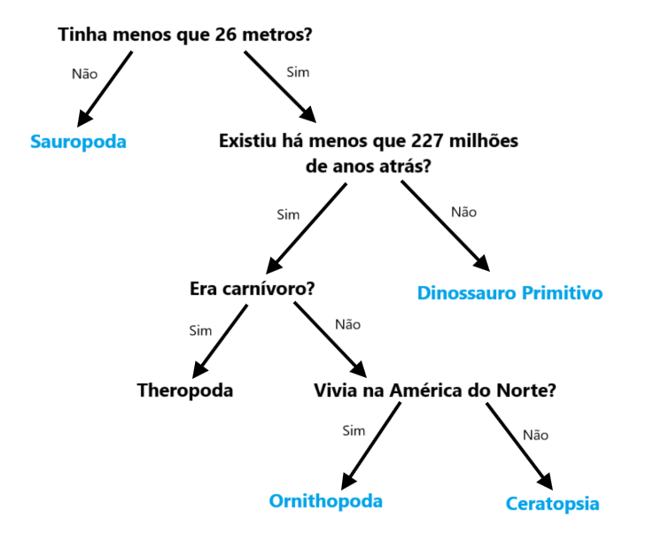

## Árvore de decisão

--- challenge ---

<html>
  

    <iframe style="position: absolute; top: 0; left: 0; right: 0; width: 100%; height: 100%; border: none;" src="https://www.youtube.com/embed/mYkxL-efCIs?rel=0&cc_load_policy=1" allowfullscreen allow="accelerometer; autoplay; clipboard-write; encrypted-media; gyroscope; picture-in-picture; web-share"></iframe>
  

</html>

Um modelo de machine learning que usa uma árvore de decisão deve refinar repetidamente os seus critérios. Quantos mais dados são inseridos mais preciso se torna — isto chama-se **treino**. Usaste apenas alguns critérios, mas um modelo de machine learning pode usar **milhares** de valores.

Aqui está um conjunto de dados maior sobre dinossauros:

(Ma = milhões de anos atrás)

| Nome            | Comprimento (m) | Dieta     | Continente       | Existência (Ma) | Categoria            |
| --------------- | ---------------------------------- | --------- | ---------------- | ---------------------------------- | -------------------- |
| Alossauro       | 12                                 | Carnívoro | Europa           | 152                                | Theropoda            |
| Archaeoceratops | 1,3                                | Herbívoro | Ásia             | 121                                | Ceratopsia           |
| Bambiraptor     | 1                                  | Carnívoro | América do Norte | 84                                 | Theropoda            |
| Braquiossauro   | 30                                 | Herbívoro | América do Norte | 155                                | Sauropoda            |
| Chindesaurus    | 4                                  | Carnívoro | América do Norte | 227                                | Dinossauro primitivo |
| Concavenator    | 6                                  | Carnívoro | Europa           | 130                                | Theropoda            |
| Diplodoco       | 26                                 | Herbívoro | América do Norte | 152                                | Sauropoda            |
| Herrerasaurus   | 3                                  | Carnívoro | América do Sul   | 228                                | Dinossauro primitivo |
| Maiasaura       | 9                                  | Herbívoro | América do Norte | 80                                 | Ornithopoda          |
| Parksosaurus    | 3                                  | Herbívoro | América do Norte | 76                                 | Ornithopoda          |
| Zephyrosaurus   | 1.8                | Herbívoro | América do Norte | 120                                | Ornithopoda          |

Porque não descarregar e imprimir estas [cartas de dinossauros](resources/dinosaur_cards.pdf){:target="_blank"} e usá-las como ajuda para desenhares a árvore de decisão?

--- task ---

Desenha uma árvore de decisão que permita identificar corretamente cada **categoria** de dinossauros.

**Dica:** Cada pergunta deve dividir os dados para que uma das categorias de dinossauros seja identificada totalmente.

--- /task ---

--- task ---

[Escolhe outro dinossauro](https://www.nhm.ac.uk/discover/dino-directory.html){:target="_blank"} e usa a tua árvore de decisão para identificar em qual categoria ele está. A tua árvore de decisão estava correta?

--- /task ---

--- collapse ---
---
title: Mostra-me a resposta
---

Aqui está uma solução possível, mas há muitas árvores válidas que podes desenhar:

--- /collapse ---

--- /challenge ---
