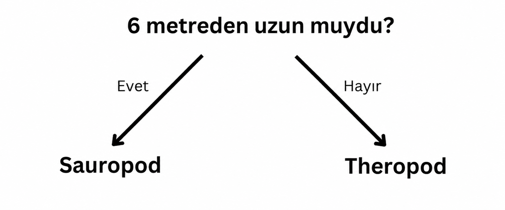

## Dinozorları sınıflandırın

<html>
  

    <iframe style="position: absolute; top: 0; left: 0; right: 0; width: 100%; height: 100%; border: none;" src="https://www.youtube.com/embed/3op4RCy1wRc?rel=0&cc_load_policy=1" allowfullscreen allow="accelerometer; autoplay; clipboard-write; encrypted-media; gyroscope; picture-in-picture; web-share"></iframe>
  

</html>

**Projenin amacı:** Her dinozorun bir **kategorisi** vardır. Bir kategori, benzer özelliklere sahip dinozor gruplarını tanımlar. Dinozor hakkında sahip olduğunuz bilgilerden yola çıkarak, dinozorun hangi kategoriye ait olduğunu belirlemeniz gerekiyor.

İşte iki farklı dinozor hakkında bazı bilgiler:

(mya = milyon yıl önce)

| İsim         | Uzunluk (m) | Diyet | Kıta          | Yaşadığı dönem (mya) | Kategori |
| ------------ | ------------------------------ | ----- | ------------- | --------------------------------------- | -------- |
| Concavenator | 6                              | Etçil | Avrupa        | 130                                     | Theropod |
| Diplodocus   | 26                             | Otçul | Kuzey Amerika | 152                                     | Sauropod |

Şu soruyu sorarak bu verileri iki dinozor kategorisine ayırabilirsiniz:

Cevap **evet** ise, dinozor bir Sauropod olmalı; **hayır** ise, bir Theropod olmalı.

--- task ---

Bu iki dinozor kategorisini birbirinden ayırmak için sorabileceğiniz farklı bir soru düşünün.

--- collapse ---
---
title: Bana cevabı göster
---

- Kuzey Amerika'da mı yaşadı?
- Etçil miydi?
- Adı 'C' harfiyle mi başlıyor?
- 130 milyon yıldan daha önce yaşamış mıydı?

--- /collapse ---

--- /task ---
