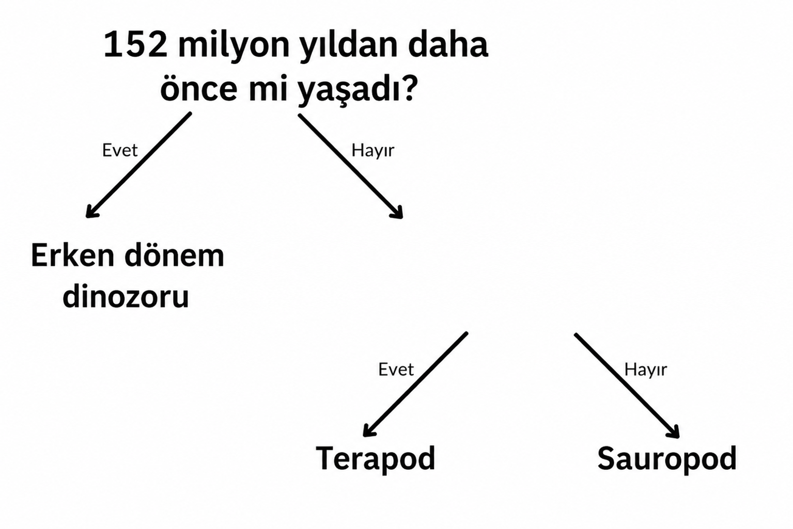

## Birden fazla soru

<html>
  

    <iframe style="position: absolute; top: 0; left: 0; right: 0; width: 100%; height: 100%; border: none;" src="https://www.youtube.com/embed/1YGBq7GWiZU?rel=0&cc_load_policy=1" allowfullscreen allow="accelerometer; autoplay; clipboard-write; encrypted-media; gyroscope; picture-in-picture; web-share"></iframe>
  

</html>

Bir dinozor daha ekleyelim:

| İsim          | Uzunluk (m) | Diyet | Kıta          | Yaşadığı dönem (mya) | Kategori       |
| ------------- | ------------------------------ | ----- | ------------- | --------------------------------------- | -------------- |
| Allosaurus    | 12                             | Etçil | Avrupa        | 152                                     | Theropod       |
| Concavenator  | 6                              | Etçil | Avrupa        | 130                                     | Theropod       |
| Diplodocus    | 26                             | Otçul | Kuzey Amerika | 152                                     | Sauropod       |
| Herrerasaurus | 3                              | Etçil | Güney Amerika | 228                                     | İlk dinozorlar |

\--- task ---

"130 milyon yıldan daha önce yaşamış mı?" sorusunu kullanarak dinozorları kategorilere ayırmanız mümkün mü?

## --- collapse ---

## başlık: Bana cevabı göster

Hayır, çünkü 130 milyon yıldan daha önce yaşamış üç dinozor türü var, ancak bunlar farklı kategorilerde yer alıyor.

Kriterleri **152 milyon yıldan daha eski** olarak değiştirseniz bile, yine de onları üç kategoriye ayıramazsınız.

\--- /collapse ---

\--- /task ---

Dinozorları üç kategoriye ayırmak için başka bir soru daha eklemeniz gerekiyor.

\--- task ---

Tablodan **farklı** bir veri seçin; örneğin, uzunluk veya beslenme şekli.

Kalan dinozorları doğru şekilde sınıflandırmak için bu verileri kullanarak boşluğa hangi soruyu yazabilirsiniz?

## --- collapse ---

## başlık: Bana cevabı göster

Aşağıdaki sorulardan herhangi biri, her dinozor için doğru kategoriyi verecektir:

- 26 metreden daha kısa mıydı?
- Etçil miydi?
- Avrupa'da mı yaşadı?

\--- /collapse ---

\--- /task ---
