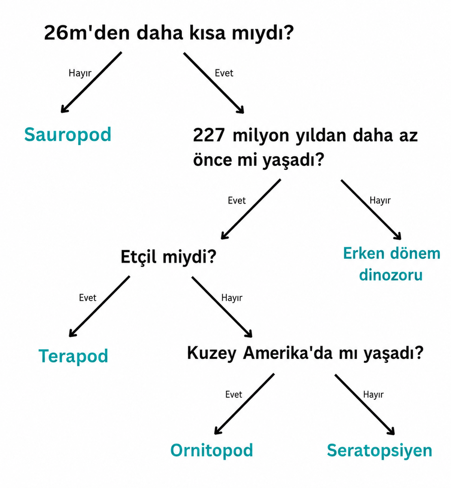

## Karar ağacı

\--- challenge ---

<html>
  

    <iframe style="position: absolute; top: 0; left: 0; right: 0; width: 100%; height: 100%; border: none;" src="https://www.youtube.com/embed/mYkxL-efCIs?rel=0&cc_load_policy=1" allowfullscreen allow="accelerometer; autoplay; clipboard-write; encrypted-media; gyroscope; picture-in-picture; web-share"></iframe>
  

</html>

Karar ağacı kullanan bir makine öğrenimi modeli, kriterlerini sürekli olarak iyileştirmelidir. Girilen veri miktarı arttıkça doğruluk da artar; buna **eğitim** denir. Siz yalnızca birkaç kriter kullandınız, ancak bir makine öğrenimi modeli **binlerce** değer kullanabilir.

İşte dinozorlarla ilgili daha geniş bir veri seti:

(mya = milyon yıl önce)

| İsim            | Uzunluk (m) | Diyet | Kıta          | Yaşadığı dönem (mya) | Kategori       |
| --------------- | ------------------------------ | ----- | ------------- | --------------------------------------- | -------------- |
| Allosaurus      | 12                             | Etçil | Avrupa        | 152                                     | Theropod       |
| Archaeoceratops | 1.3            | Otçul | Asya          | 121                                     | Ceratopsian    |
| Bambiraptor     | 1                              | Etçil | Kuzey Amerika | 84                                      | Theropod       |
| Brachiosaurus   | 30                             | Otçul | Kuzey Amerika | 155                                     | Sauropod       |
| Chindesaurus    | 4                              | Etçil | Kuzey Amerika | 227                                     | İlk dinozorlar |
| Concavenator    | 6                              | Etçil | Avrupa        | 130                                     | Theropod       |
| Diplodocus      | 26                             | Otçul | Kuzey Amerika | 152                                     | Sauropod       |
| Herrerasaurus   | 3                              | Etçil | Güney Amerika | 228                                     | İlk dinozorlar |
| Maiasaura       | 9                              | Otçul | Kuzey Amerika | 80                                      | Ornithopod     |
| Parksosaurus    | 3                              | Otçul | Kuzey Amerika | 76                                      | Ornithopod     |
| Zephyrosaurus   | 1.8            | Otçul | Kuzey Amerika | 120                                     | Ornithopod     |

Neden bu [dinozor kartlarını](resources/dinosaur_cards.pdf){:target="_blank"} indirip ve yazdırıp karar ağacını çizmenize yardımcı olmaları için kullanmıyorsunuz?

\--- task ---

Dinozorların her bir **kategorisini** doğru bir şekilde tanımlamanıza olanak tanıyan bir karar ağacı çizin.

**İpucu:** Her soru, dinozor kategorilerinden birinin tamamen tanımlanmasını sağlayacak şekilde verileri bölmelidir.

\--- /task ---

\--- task ---

[Başka bir dinozor seçin](https://www.nhm.ac.uk/discover/dino-directory.html){:target="_blank"} ve karar ağacınızı kullanarak hangi kategoriye ait olduğunu belirleyin. Karar ağacınız doğru muydu?

\--- /task ---

## --- collapse ---

## başlık: Bana cevabı göster

İşte olası bir çözüm, ancak çizebileceğiniz birçok geçerli ağaç var:

\--- /collapse ---

\--- /challenge ---
