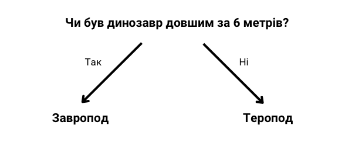

## Класифікуй динозаврів

<html>
  

    <iframe style="position: absolute; top: 0; left: 0; right: 0; width: 100%; height: 100%; border: none;" src="https://www.youtube.com/embed/3op4RCy1wRc?rel=0&cc_load_policy=1" allowfullscreen allow="accelerometer; autoplay; clipboard-write; encrypted-media; gyroscope; picture-in-picture; web-share"></iframe>
  

</html>

**Мета проєкту:** кожен динозавр має **категорію**. Категорія описує групу динозаврів зі схожими характеристиками. Ти маєш сказати, до якої категорії відноситься динозавр, використовуючи наявні у тебе факти про цього динозавра.

Ось кілька фактів про двох різних динозаврів:

| Назва        | Довжина (м) | Їжа     | Континент        | Коли жив (мільйонів років тому) | Категорія |
| ------------ | ------------------------------ | ------- | ---------------- | -------------------------------------------------- | --------- |
| Конкавенатор | 6                              | Мʼясо   | Європа           | 130                                                | Теропод   |
| Диплодок     | 26                             | Рослини | Північна Америка | 152                                                | Завропод  |

Ти можеш розділити ці дані на дві **категорії**, поставивши таке запитання:

Якщо відповідь **так**, динозавр має бути завроподом, а якщо **ні**, то він має бути тероподом.

--- task ---

Яке ще запитання можна поставити, щоб розділити ці дві категорії динозаврів?

--- collapse ---
---
title: Покажіть мені відповідь
---

- Чи жив він у Північній Америці?
- Чи був він мʼясоїдним?
- Чи починається його назва на «к»?
- Чи жив він понад 130 мільйонів років тому?

--- /collapse ---

--- /task ---
