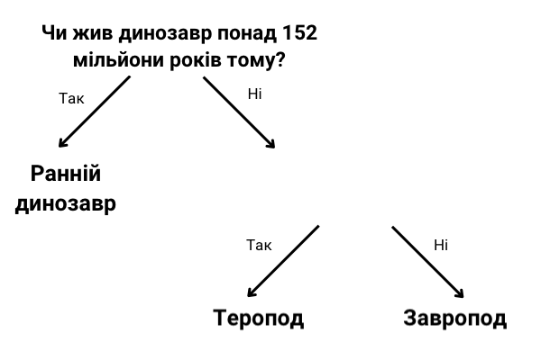

## Більше одного питання

<html>
  

    <iframe style="position: absolute; top: 0; left: 0; right: 0; width: 100%; height: 100%; border: none;" src="https://www.youtube.com/embed/1YGBq7GWiZU?rel=0&cc_load_policy=1" allowfullscreen allow="accelerometer; autoplay; clipboard-write; encrypted-media; gyroscope; picture-in-picture; web-share"></iframe>
  

</html>

Додамо ще одного динозавра:

| Назва        | Довжина (м) | Їжа     | Континент        | Коли жив (мільйонів років тому) | Категорія       |
| ------------ | ------------------------------ | ------- | ---------------- | -------------------------------------------------- | --------------- |
| Алозавр      | 12                             | Мʼясо   | Європа           | 152                                                | Теропод         |
| Конкавенатор | 6                              | Мʼясо   | Європа           | 130                                                | Теропод         |
| Диплодок     | 26                             | Рослини | Північна Америка | 152                                                | Завропод        |
| Герреразавр  | 3                              | Мʼясо   | Південна Америка | 228                                                | Ранній динозавр |

\--- task ---

Чи можна розділити динозаврів на категорії за допомогою запитання **«Чи жив він понад 130 мільйонів років тому?»**?

## --- collapse ---

## title: Покажіть мені відповідь

Ні, тому що зараз у нас є три динозаври, які жили понад 130 мільйонів років тому, але вони належать до різних категорій.

Навіть якщо ти зміниш критерій на **понад 152 мільйони років тому**, ти все одно не зможеш розділити їх на три категорії.

\--- /collapse ---

\--- /task ---

Щоб розділити динозаврів на три категорії, потрібно додати ще одне запитання.

\--- task ---

Вибери **ще один** елемент даних із таблиці, наприклад, довжину або їжу.

Яке запитання можна написати, щоб правильно класифікувати решту динозаврів? Розмісти ці дані на місці пропуску.

## --- collapse ---

## title: Покажіть мені відповідь

Будь-яке з наступних питань розподілить кожного динозавра у правильну категорію:

- Чи був він коротшим за 26 метрів?
- Чи був він мʼясоїдним?
- Чи жив він у Європі?

\--- /collapse ---

\--- /task ---
