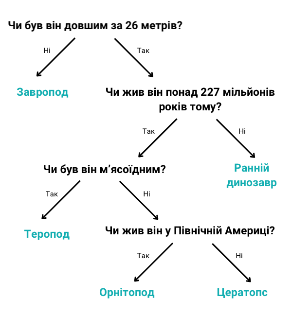

## Дерево рішень

\--- challenge ---

<html>
  

    <iframe style="position: absolute; top: 0; left: 0; right: 0; width: 100%; height: 100%; border: none;" src="https://www.youtube.com/embed/mYkxL-efCIs?rel=0&cc_load_policy=1" allowfullscreen allow="accelerometer; autoplay; clipboard-write; encrypted-media; gyroscope; picture-in-picture; web-share"></iframe>
  

</html>

Модель машинного навчання, яка використовує дерево рішень, повинна постійно вдосконалювати свої критерії. Чим більше даних вводиться, тим точнішими вони стають — це називається **навчанням**. Ми використали лише кілька критеріїв, але модель машинного навчання може використовувати багато **тисяч** значень.

Ось більший набір даних про динозаврів:

| Назва         | Довжина (м) | Їжа        | Континент        | Коли жив (мільйонів років тому) | Категорія       |
| ------------- | ------------------------------ | ---------- | ---------------- | -------------------------------------------------- | --------------- |
| Алозавр       | 12                             | Мʼясоїдний | Європа           | 152                                                | Теропод         |
| Археоцератопс | 1,3                            | Травоїдний | Азія             | 121                                                | Цератопс        |
| Бембіраптор   | 1                              | Мʼясоїдний | Північна Америка | 84                                                 | Теропод         |
| Брахіозавр    | 30                             | Травоїдний | Північна Америка | 155                                                | Завропод        |
| Чиндезавр     | 4                              | Мʼясоїдний | Північна Америка | 227                                                | Ранній динозавр |
| Конкавенатор  | 6                              | Мʼясоїдний | Європа           | 130                                                | Теропод         |
| Диплодок      | 26                             | Травоїдний | Північна Америка | 152                                                | Завропод        |
| Герреразавр   | 3                              | Мʼясоїдний | Південна Америка | 228                                                | Ранній динозавр |
| Маязавр       | 9                              | Травоїдний | Північна Америка | 80                                                 | Орнітопод       |
| Парксозавр    | 3                              | Травоїдний | Північна Америка | 76                                                 | Орнітопод       |
| Зефірозавр    | 1,8                            | Травоїдний | Північна Америка | 120                                                | Орнітопод       |

Спробуй завантажити й роздрукувати ці [картки з динозаврами](resources/dinosaur_cards.pdf){:target="_blank"} і використай їх, щоб намалювати дерево рішень.

\--- task ---

Намалюй дерево рішень, яке дозволить тобі правильно ідентифікувати кожну **категорію** динозавра.

**Порада:** кожне запитання має розділити дані таким чином, щоб повністю визначити одну категорію динозаврів.

\--- /task ---

\--- task ---

[Вибери ще одного динозавра](https://www.nhm.ac.uk/discover/dino-directory.html){:target="_blank"} і використай дерево рішень, щоб визначити, до якої категорії він належить. Чи правильним виявилось дерево рішень?

\--- /task ---

## --- collapse ---

## title: Покажіть мені відповідь

Ось одне з можливих рішень, але ти можеш намалювати багато правильних варіантів дерев:

\--- /collapse ---

\--- /challenge ---
